# Porcelain ERP 设计文档

> 文档版本：v1.0
> 创建日期：2026-06-07
> 作者：UX 设计师 + 架构师
> 状态：已完成

---

# 第一部分：UX 设计


## 一、信息架构

### 1.1 全站导航结构（侧边栏菜单层级）

侧边栏采用分组导航，分为 4 个组：主导航、生产管理、协同工具、系统管理。

```
NEXUS ERP
├── 主导航
│   ├── 仪表盘 (dashboard)
│   ├── 采购管理 (purchase)          [角标: 待审批数]
│   ├── 销售管理 (sales)             [角标: 待处理数]
│   ├── 库存管理 (inventory)
│   ├── 财务管理 (finance)
│   ├── 人力资源 (hr)
│   └── 报表分析 (reports)
├── 生产管理
│   ├── 生产计划 (production-plan)   [角标: 待排程数]
│   ├── 车间执行 (workshop-exec)
│   └── 生产看板 (production-dashboard)
├── 协同工具
│   ├── 生成管理 (generation)        [角标: 运行中任务数]
│   ├── 通知审批 (notifications)     [角标: 待审批数]
│   └── 消息对话 (messages)          [角标: 未读消息数]
├── 系统管理
│   ├── 操作日志 (operation-logs)
│   ├── 数据备份 (data-backup)
│   ├── 个人中心 (profile)
│   └── 系统设置 (settings)
└── [用户头像 + 锁屏/登出]
```

### 1.2 页面清单与层级关系

| 层级 | 页面 | 路由 | 说明 |
|---|---|---|---|
| L0 | 登录页 | `/login` | 全屏覆盖层，非布局内页面 |
| L0 | 锁屏 | — | 全屏覆盖层，PIN/密码解锁 |
| L1 | 仪表盘 | `/dashboard` | 默认首页 |
| L1 | 采购管理 | `/purchase` | Tab 切换：采购订单 / 供应商管理 |
| L2 | 采购单详情 | `/purchase/:id` | 抽屉或子页面 |
| L2 | 新建采购单 | `/purchase/new` | 弹窗或子页面 |
| L2 | 供应商详情 | `/purchase/supplier/:id` | 抽屉 |
| L1 | 销售管理 | `/sales` | Tab 切换：销售订单 / 客户管理 |
| L2 | 销售单详情 | `/sales/:id` | 抽屉或子页面 |
| L2 | 新建销售单 | `/sales/new` | 弹窗或子页面 |
| L2 | 客户详情 | `/sales/customer/:id` | 抽屉 |
| L1 | 库存管理 | `/inventory` | 含仓库概览 + 产品列表 |
| L2 | 出入库记录 | `/inventory/transactions` | 子页面 |
| L2 | 库存盘点 | `/inventory/stocktake` | 子页面 |
| L1 | 财务管理 | `/finance` | KPI + 现金流 + 流水 |
| L1 | 人力资源 | `/hr` | 员工列表 + 部门分布 |
| L2 | 员工详情 | `/hr/:id` | 右侧面板 |
| L1 | 报表分析 | `/reports` | 报表列表 + 图表 |
| L1 | 生产计划 | `/production-plan` | 列表/甘特图视图切换 |
| L2 | 工单详情 | `/production-plan/:id` | 抽屉 |
| L1 | 车间执行 | `/workshop-exec` | 工位状态 + 工序流程 + 报工 |
| L1 | 生产看板 | `/production-dashboard` | KPI + 图表 + 预警 |
| L1 | 生成管理 | `/generation` | AI 任务列表 |
| L1 | 通知审批 | `/notifications` | Tab 切换：审批事项 / 系统消息 |
| L1 | 消息对话 | `/messages` | 联系人列表 + 聊天窗口 |
| L1 | 操作日志 | `/operation-logs` | 日志列表 + 筛选 |
| L1 | 数据备份 | `/data-backup` | 备份列表 + 操作 |
| L1 | 个人中心 | `/profile` | 个人信息 + 安全 + 动态 |
| L1 | 系统设置 | `/settings` | 左侧 Tab：资料/通知/安全/系统 |

### 1.3 页面流转图

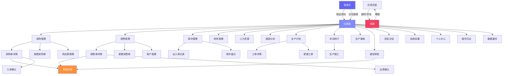
```mermaid
graph TD
    LOGIN[登录页] -->|验证成功| DASH[仪表盘]
    LOGIN -->|记住登录| DASH

    DASH --> PURCHASE[采购管理]
    DASH --> SALES[销售管理]
    DASH --> INVENTORY[库存管理]
    DASH --> FINANCE[财务管理]
    DASH --> HR[人力资源]
    DASH --> REPORTS[报表分析]

    PURCHASE --> PO_DETAIL[采购单详情]
    PURCHASE --> PO_NEW[新建采购单]
    PURCHASE --> SUPPLIER[供应商管理]
    PO_DETAIL --> APPROVAL[审批流程]
    PO_DETAIL --> IN_IN[入库确认]

    SALES --> SO_DETAIL[销售单详情]
    SALES --> SO_NEW[新建销售单]
    SALES --> CUSTOMER[客户管理]
    SO_DETAIL --> APPROVAL
    SO_DETAIL --> OUT_IN[出库确认]

    INVENTORY --> IN_OUT[出入库记录]
    INVENTORY --> STOCKTAKE[库存盘点]

    DASH --> PROD_PLAN[生产计划]
    DASH --> WORKSHOP[车间执行]
    DASH --> PROD_DASH[生产看板]

    PROD_PLAN --> WO_DETAIL[工单详情]
    PROD_PLAN --> WO_NEW[新建工单]
    WORKSHOP --> REPORT_WORK[生产报工]

    DASH --> NOTIF[通知审批]
    DASH --> MSG[消息对话]
    NOTIF --> APPROVAL

    DASH --> SETTINGS[系统设置]
    DASH --> PROFILE[个人中心]
    DASH --> LOGS[操作日志]
    DASH --> BACKUP[数据备份]

    ANY[任意页面] -->|超时/手动| LOCK[锁屏]
    LOCK -->|解锁| ANY

    style LOGIN fill:#6366f1,color:#fff
    style DASH fill:#818cf8,color:#fff
    style LOCK fill:#f43f5e,color:#fff
    style APPROVAL fill:#fb923c,color:#fff
```

---

## 二、交互流程设计

### 2.1 认证流程

#### 2.1.1 登录流程

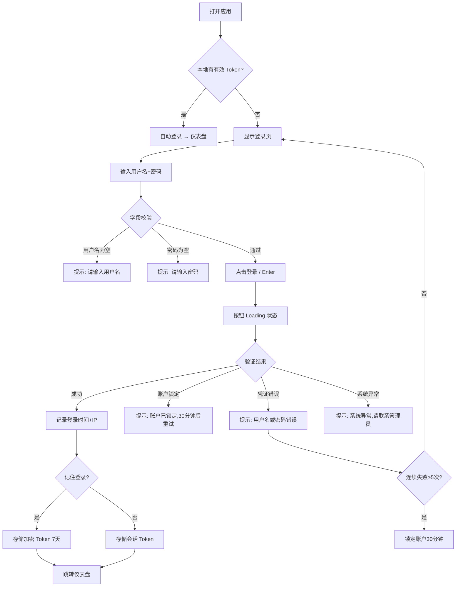
```mermaid
flowchart TD
    A[打开应用] --> B{本地有有效 Token?}
    B -->|是| C[自动登录 → 仪表盘]
    B -->|否| D[显示登录页]
    D --> E[输入用户名+密码]
    E --> F{字段校验}
    F -->|用户名为空| G[提示: 请输入用户名]
    F -->|密码为空| H[提示: 请输入密码]
    F -->|通过| I[点击登录 / Enter]
    I --> J[按钮 Loading 状态]
    J --> K{验证结果}
    K -->|成功| L[记录登录时间+IP]
    L --> M{记住登录?}
    M -->|是| N[存储加密 Token 7天]
    M -->|否| O[存储会话 Token]
    N --> P[跳转仪表盘]
    O --> P
    K -->|账户锁定| Q[提示: 账户已锁定,30分钟后重试]
    K -->|凭证错误| R[提示: 用户名或密码错误]
    R --> S{连续失败≥5次?}
    S -->|是| T[锁定账户30分钟]
    S -->|否| D
    K -->|系统异常| U[提示: 系统异常,请联系管理员]
```

**交互细节**：
- 登录页采用左右分栏：左侧品牌展示（极光动画+特性卡片），右侧登录表单
- 密码输入框右侧有显示/隐藏切换按钮
- "记住登录状态"复选框 + "忘记密码"链接
- 登录按钮渐变色 + 霓虹光效，Loading 时显示旋转图标 + "验证中..."
- Enter 键快捷提交
- 错误提示使用 toast 通知，不使用 alert

#### 2.1.2 锁屏/解锁流程

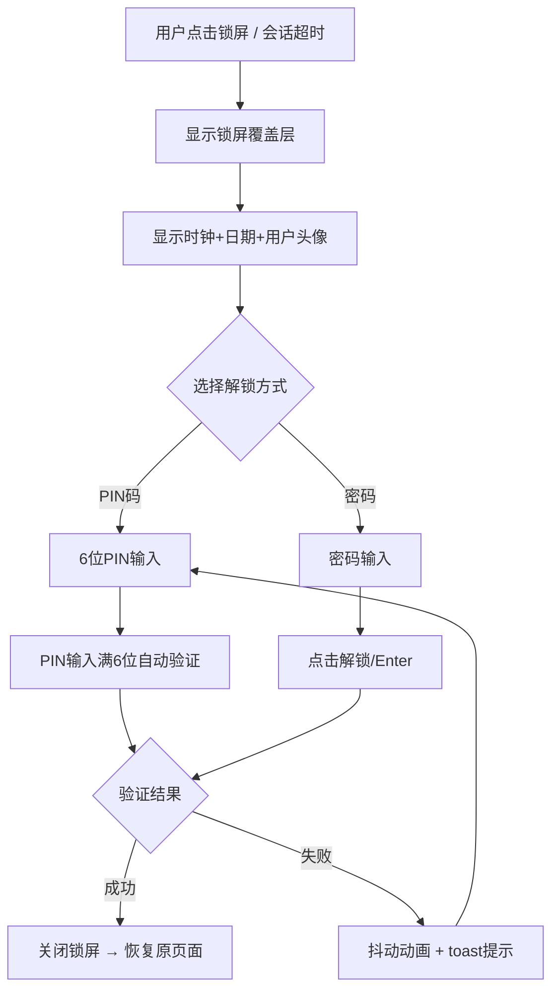
```mermaid
flowchart TD
    A[用户点击锁屏 / 会话超时] --> B[显示锁屏覆盖层]
    B --> C[显示时钟+日期+用户头像]
    C --> D{选择解锁方式}
    D -->|PIN码| E[6位PIN输入]
    D -->|密码| F[密码输入]
    E --> G[PIN输入满6位自动验证]
    G --> H{验证结果}
    F --> I[点击解锁/Enter]
    I --> H
    H -->|成功| J[关闭锁屏 → 恢复原页面]
    H -->|失败| K[抖动动画 + toast提示]
    K --> E
```

**交互细节**：
- 锁屏为全屏覆盖层，z-index: 8888，backdrop-filter: blur(24px)
- 显示实时时钟（大字体）+ 日期
- PIN 码模式：6 个圆点指示器 + 数字键盘，输入满自动验证
- 密码模式：输入框 + 解锁按钮
- 验证失败：圆点/输入框抖动动画 + toast 错误提示
- PIN/密码模式可切换

#### 2.1.3 会话超时处理

- 默认 30 分钟无操作自动锁屏（可在系统设置中配置 5-120 分钟）
- 锁屏前 5 分钟弹出 toast 提醒："即将自动锁屏，点击继续操作"
- 锁屏后保留当前页面状态，解锁后恢复

### 2.2 采购管理流程

#### 2.2.1 采购单创建流程

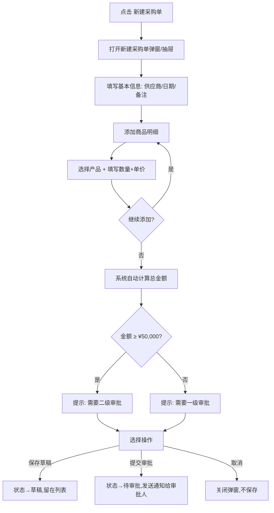
```mermaid
flowchart TD
    A[点击 新建采购单] --> B[打开新建采购单弹窗/抽屉]
    B --> C[填写基本信息: 供应商/日期/备注]
    C --> D[添加商品明细]
    D --> E[选择产品 + 填写数量+单价]
    E --> F{继续添加?}
    F -->|是| D
    F -->|否| G[系统自动计算总金额]
    G --> H{金额 ≥ ¥50,000?}
    H -->|是| I[提示: 需要二级审批]
    H -->|否| J[提示: 需要一级审批]
    I --> K[选择操作]
    J --> K
    K -->|保存草稿| L[状态→草稿,留在列表]
    K -->|提交审批| M[状态→待审批,发送通知给审批人]
    K -->|取消| N[关闭弹窗,不保存]
```

**交互细节**：
- 新建采购单使用右侧抽屉（Drawer），宽度 560px
- 供应商选择使用搜索下拉框，输入即搜索
- 商品明细使用可编辑表格行，支持行内增删
- 金额实时计算，超过 ¥50,000 自动标注"需二级审批"
- 底部操作栏固定：保存草稿（次要按钮）+ 提交审批（主要按钮）

#### 2.2.2 采购审批流程

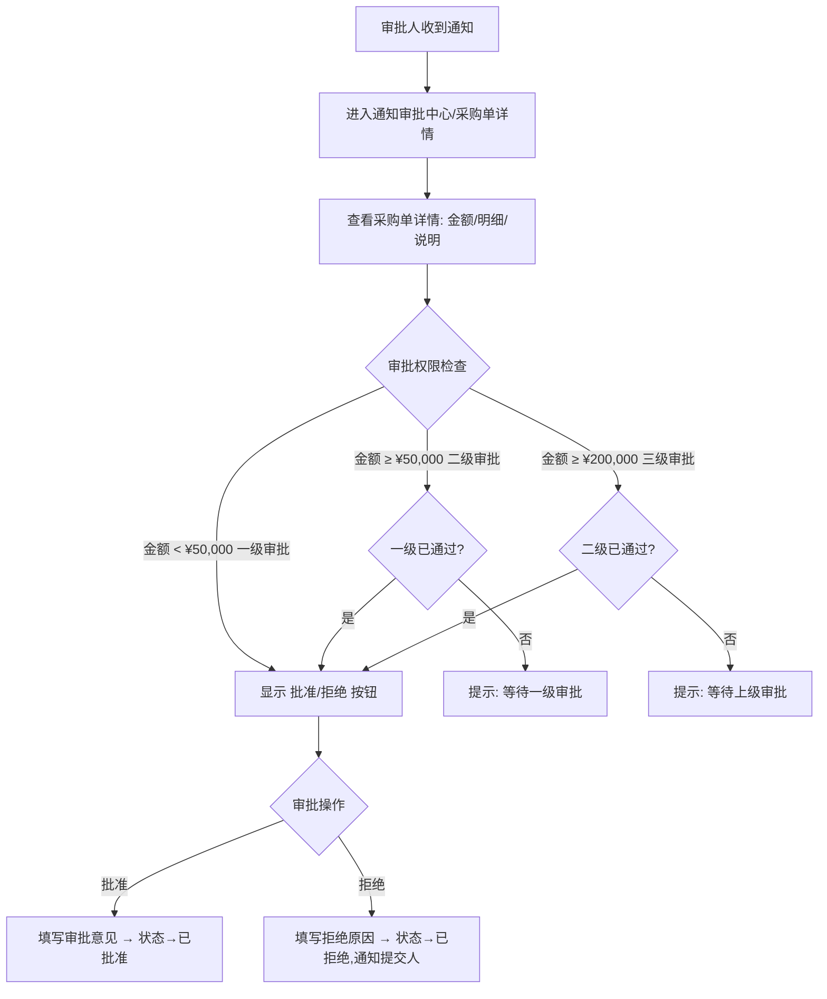
```mermaid
flowchart TD
    A[审批人收到通知] --> B[进入通知审批中心/采购单详情]
    B --> C[查看采购单详情: 金额/明细/说明]
    C --> D{审批权限检查}
    D -->|金额 < ¥50,000 一级审批| E[显示 批准/拒绝 按钮]
    D -->|金额 ≥ ¥50,000 二级审批| F{一级已通过?}
    F -->|否| G[提示: 等待一级审批]
    F -->|是| E
    D -->|金额 ≥ ¥200,000 三级审批| H{二级已通过?}
    H -->|否| I[提示: 等待上级审批]
    H -->|是| E
    E --> J{审批操作}
    J -->|批准| K[填写审批意见 → 状态→已批准]
    J -->|拒绝| L[填写拒绝原因 → 状态→已拒绝,通知提交人]
```

**交互细节**：
- 审批操作在采购单详情页或通知审批中心完成
- 批准/拒绝按钮仅对有权限且状态为"待审批"的单据显示
- 拒绝必须填写原因（必填），批准可选择性填写意见
- 审批操作后即时更新状态，通知提交人

#### 2.2.3 到货确认流程

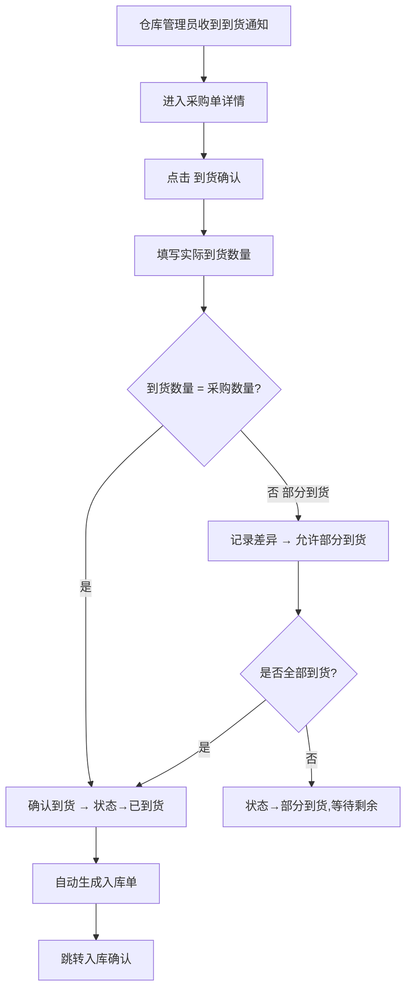
```mermaid
flowchart TD
    A[仓库管理员收到到货通知] --> B[进入采购单详情]
    B --> C[点击 到货确认]
    C --> D[填写实际到货数量]
    D --> E{到货数量 = 采购数量?}
    E -->|是| F[确认到货 → 状态→已到货]
    E -->|否 部分到货| G[记录差异 → 允许部分到货]
    G --> H{是否全部到货?}
    H -->|是| F
    H -->|否| I[状态→部分到货,等待剩余]
    F --> J[自动生成入库单]
    J --> K[跳转入库确认]
```

### 2.3 销售管理流程

#### 2.3.1 销售单创建流程

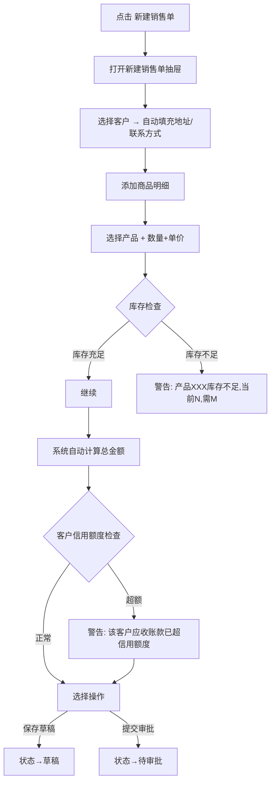
```mermaid
flowchart TD
    A[点击 新建销售单] --> B[打开新建销售单抽屉]
    B --> C[选择客户 → 自动填充地址/联系方式]
    C --> D[添加商品明细]
    D --> E[选择产品 + 数量+单价]
    E --> F{库存检查}
    F -->|库存充足| G[继续]
    F -->|库存不足| H[警告: 产品XXX库存不足,当前N,需M]
    G --> I[系统自动计算总金额]
    I --> J{客户信用额度检查}
    J -->|超额| K[警告: 该客户应收账款已超信用额度]
    J -->|正常| L[选择操作]
    K --> L
    L -->|保存草稿| M[状态→草稿]
    L -->|提交审批| N[状态→待审批]
```

#### 2.3.2 销售审批流程

与采购审批类似，销售单审批流程：草稿 → 待审批 → 已批准 → 处理中 → 已发货 → 已完成/已取消。

#### 2.3.3 发货流程

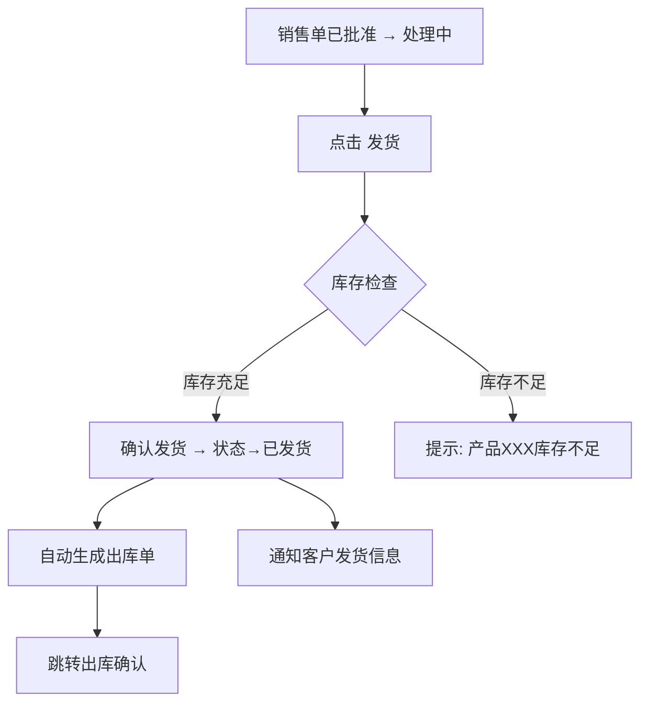
```mermaid
flowchart TD
    A[销售单已批准 → 处理中] --> B[点击 发货]
    B --> C{库存检查}
    C -->|库存充足| D[确认发货 → 状态→已发货]
    C -->|库存不足| E[提示: 产品XXX库存不足]
    D --> F[自动生成出库单]
    F --> G[跳转出库确认]
    D --> H[通知客户发货信息]
```

### 2.4 库存管理流程

#### 2.4.1 入库流程

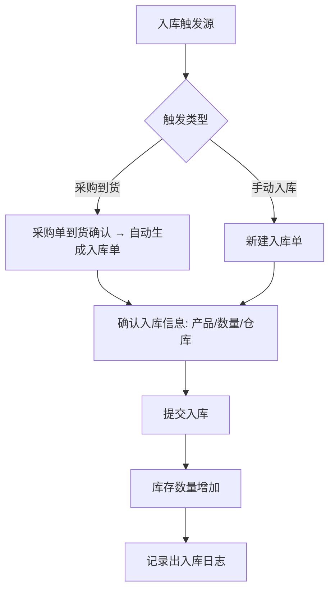
```mermaid
flowchart TD
    A[入库触发源] --> B{触发类型}
    B -->|采购到货| C[采购单到货确认 → 自动生成入库单]
    B -->|手动入库| D[新建入库单]
    C --> E[确认入库信息: 产品/数量/仓库]
    D --> E
    E --> F[提交入库]
    F --> G[库存数量增加]
    G --> H[记录出入库日志]
```

#### 2.4.2 出库流程

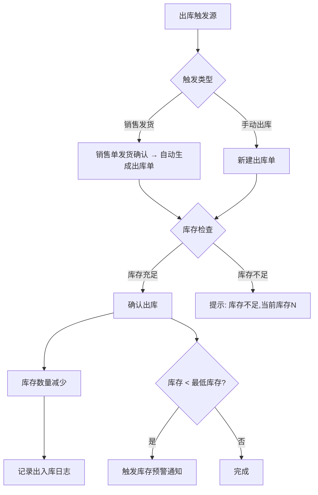
```mermaid
flowchart TD
    A[出库触发源] --> B{触发类型}
    B -->|销售发货| C[销售单发货确认 → 自动生成出库单]
    B -->|手动出库| D[新建出库单]
    C --> E{库存检查}
    D --> E
    E -->|库存充足| F[确认出库]
    E -->|库存不足| G[提示: 库存不足,当前库存N]
    F --> H[库存数量减少]
    H --> I[记录出入库日志]
    F --> J{库存 < 最低库存?}
    J -->|是| K[触发库存预警通知]
    J -->|否| L[完成]
```

#### 2.4.3 库存盘点流程

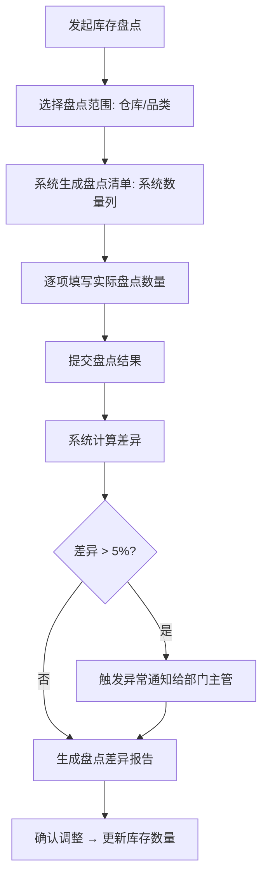
```mermaid
flowchart TD
    A[发起库存盘点] --> B[选择盘点范围: 仓库/品类]
    B --> C[系统生成盘点清单: 系统数量列]
    C --> D[逐项填写实际盘点数量]
    D --> E[提交盘点结果]
    E --> F[系统计算差异]
    F --> G{差异 > 5%?}
    G -->|是| H[触发异常通知给部门主管]
    G -->|否| I[生成盘点差异报告]
    H --> I
    I --> J[确认调整 → 更新库存数量]
```

### 2.5 生产管理流程

#### 2.5.1 工单创建流程

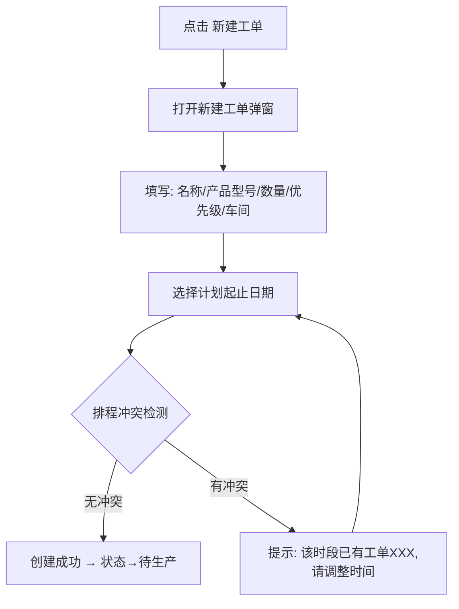
```mermaid
flowchart TD
    A[点击 新建工单] --> B[打开新建工单弹窗]
    B --> C[填写: 名称/产品型号/数量/优先级/车间]
    C --> D[选择计划起止日期]
    D --> E{排程冲突检测}
    E -->|无冲突| F[创建成功 → 状态→待生产]
    E -->|有冲突| G[提示: 该时段已有工单XXX,请调整时间]
    G --> D
```

#### 2.5.2 甘特图拖拽排程交互

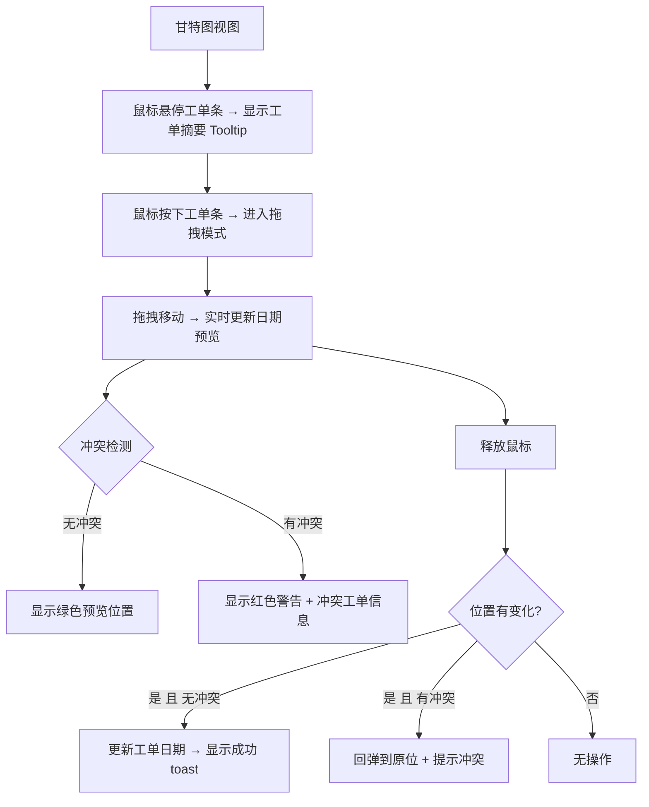
```mermaid
flowchart TD
    A[甘特图视图] --> B[鼠标悬停工单条 → 显示工单摘要 Tooltip]
    B --> C[鼠标按下工单条 → 进入拖拽模式]
    C --> D[拖拽移动 → 实时更新日期预览]
    D --> E{冲突检测}
    E -->|无冲突| F[显示绿色预览位置]
    E -->|有冲突| G[显示红色警告 + 冲突工单信息]
    D --> H[释放鼠标]
    H --> I{位置有变化?}
    I -->|是 且 无冲突| J[更新工单日期 → 显示成功 toast]
    I -->|是 且 有冲突| K[回弹到原位 + 提示冲突]
    I -->|否| L[无操作]
```

**交互细节**：
- 拖拽时原位置显示虚线幽灵条（ghost bar）
- 拖拽条上方显示日期范围 Tooltip
- 拖拽条放大 1.08 倍 + 增强阴影
- 按天对齐（snap to day），不允许半天粒度
- 已完成工单不可拖拽，鼠标样式为 not-allowed
- 今日标记线为红色竖线

#### 2.5.3 车间报工流程

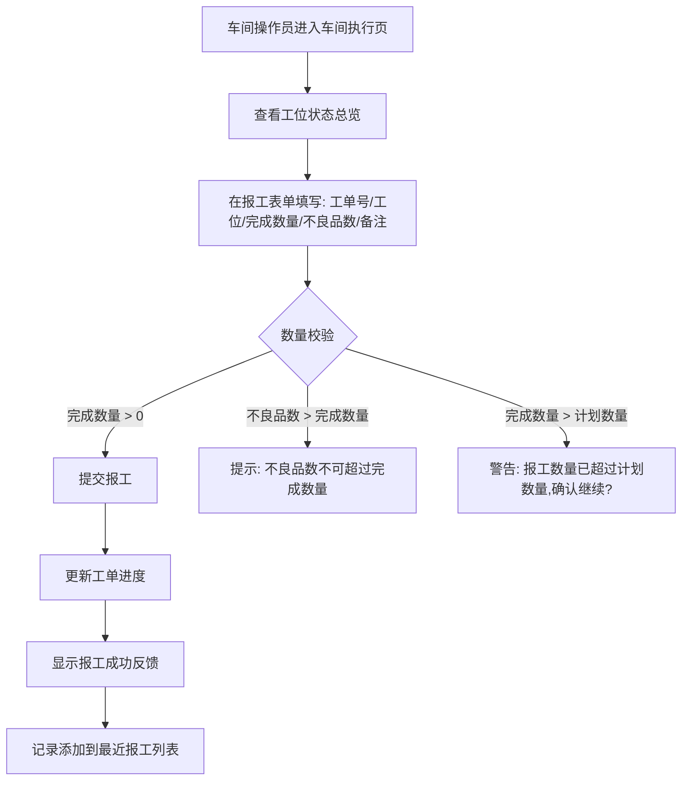
```mermaid
flowchart TD
    A[车间操作员进入车间执行页] --> B[查看工位状态总览]
    B --> C[在报工表单填写: 工单号/工位/完成数量/不良品数/备注]
    C --> D{数量校验}
    D -->|完成数量 > 0| E[提交报工]
    D -->|不良品数 > 完成数量| F[提示: 不良品数不可超过完成数量]
    D -->|完成数量 > 计划数量| G[警告: 报工数量已超过计划数量,确认继续?]
    E --> H[更新工单进度]
    H --> I[显示报工成功反馈]
    I --> J[记录添加到最近报工列表]
```

**交互细节**：
- 报工表单位于右侧固定面板，始终可见
- 提交按钮点击后变为"✓ 报工成功"状态，2.5 秒后恢复
- 工位状态每 5 秒自动刷新，刷新时图标旋转动画
- 异常工位（温度>80°C 或 负载>90%）自动预警

### 2.6 通知审批流程

#### 2.6.1 审批操作流程

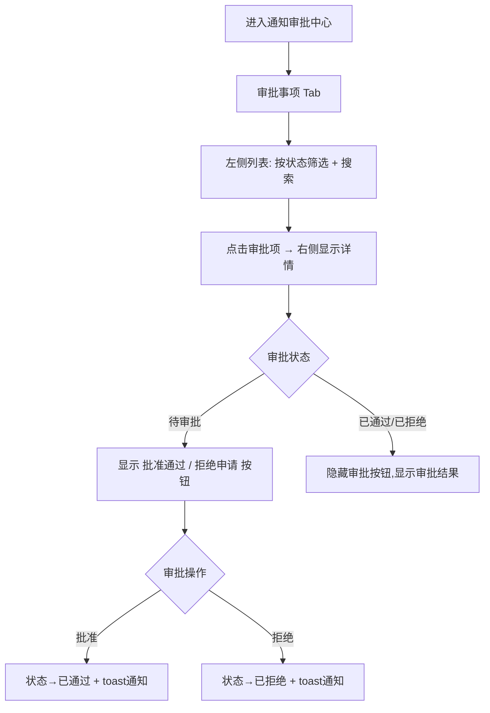
```mermaid
flowchart TD
    A[进入通知审批中心] --> B[审批事项 Tab]
    B --> C[左侧列表: 按状态筛选 + 搜索]
    C --> D[点击审批项 → 右侧显示详情]
    D --> E{审批状态}
    E -->|待审批| F[显示 批准通过 / 拒绝申请 按钮]
    E -->|已通过/已拒绝| G[隐藏审批按钮,显示审批结果]
    F --> H{审批操作}
    H -->|批准| I[状态→已通过 + toast通知]
    H -->|拒绝| J[状态→已拒绝 + toast通知]
```

**交互细节**：
- 左右分栏布局：左侧 400px 列表 + 右侧详情
- 列表项显示：标题、提交人、部门、金额、优先级标签、状态标签
- 详情区显示：类型标签、标题、提交人信息、申请说明、审批按钮
- 审批按钮：批准（绿色边框）+ 拒绝（红色边框）

#### 2.6.2 通知阅读流程

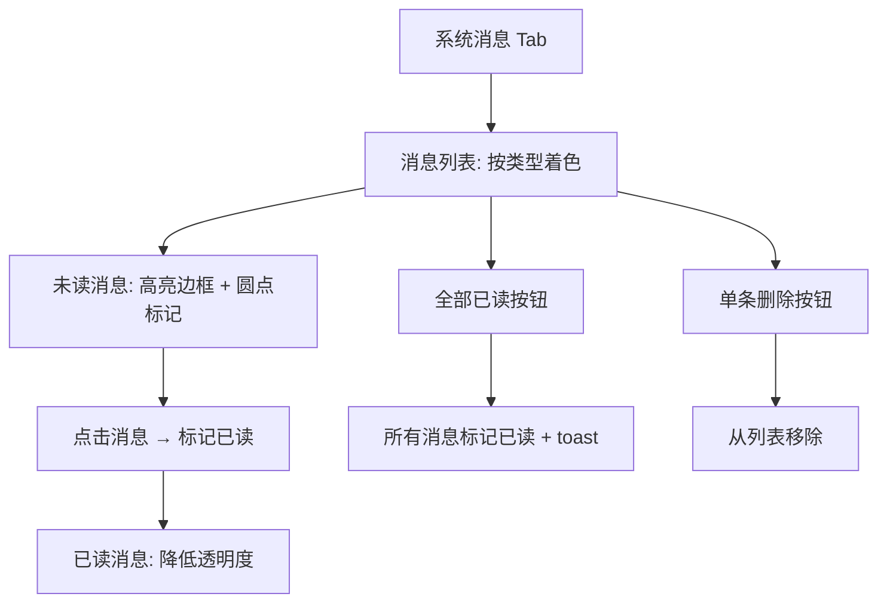
```mermaid
flowchart TD
    A[系统消息 Tab] --> B[消息列表: 按类型着色]
    B --> C[未读消息: 高亮边框 + 圆点标记]
    C --> D[点击消息 → 标记已读]
    D --> E[已读消息: 降低透明度]
    B --> F[全部已读按钮]
    F --> G[所有消息标记已读 + toast]
    B --> H[单条删除按钮]
    H --> I[从列表移除]
```

---

## 三、状态定义

### 3.1 采购单状态机

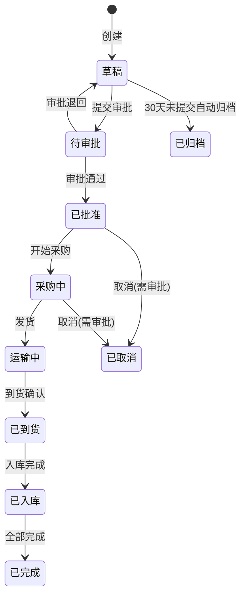
```mermaid
stateDiagram-v2
    [*] --> 草稿: 创建
    草稿 --> 待审批: 提交审批
    草稿 --> 已归档: 30天未提交自动归档
    待审批 --> 已批准: 审批通过
    待审批 --> 草稿: 审批退回
    已批准 --> 采购中: 开始采购
    采购中 --> 运输中: 发货
    运输中 --> 已到货: 到货确认
    已到货 --> 已入库: 入库完成
    已入库 --> 已完成: 全部完成
    已批准 --> 已取消: 取消(需审批)
    采购中 --> 已取消: 取消(需审批)
```

| 状态 | 颜色 | 图标 | 标签样式 |
|---|---|---|---|
| 草稿 | `#8892b0` 灰色 | FileTextIcon | 灰色背景 + 灰色边框 |
| 待审批 | `#fb923c` 橙色 | ClockIcon | 橙色背景 + 橙色边框 |
| 已批准 | `#22d3ee` 青色 | CheckCircleIcon | 青色背景 + 青色边框 |
| 采购中 | `#818cf8` 紫色 | ShoppingCartIcon | 紫色背景 + 紫色边框 |
| 运输中 | `#818cf8` 紫色 | TruckIcon | 紫色背景 + 紫色边框 |
| 已到货 | `#34d399` 绿色 | PackageCheckIcon | 绿色背景 + 绿色边框 |
| 已入库 | `#34d399` 绿色 | ArchiveIcon | 绿色背景 + 绿色边框 |
| 已完成 | `#4ade80` 亮绿 | CheckCircleIcon | 亮绿背景 + 亮绿边框 |
| 已取消 | `#f43f5e` 红色 | XCircleIcon | 红色背景 + 红色边框 |
| 已归档 | `#4a5568` 深灰 | ArchiveIcon | 深灰背景 + 深灰边框 |

### 3.2 销售单状态机

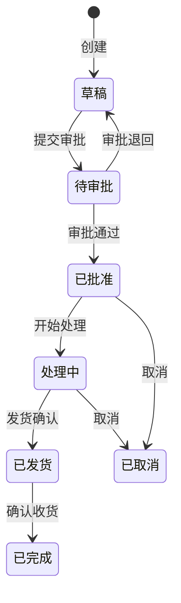
```mermaid
stateDiagram-v2
    [*] --> 草稿: 创建
    草稿 --> 待审批: 提交审批
    待审批 --> 已批准: 审批通过
    待审批 --> 草稿: 审批退回
    已批准 --> 处理中: 开始处理
    处理中 --> 已发货: 发货确认
    已发货 --> 已完成: 确认收货
    已批准 --> 已取消: 取消
    处理中 --> 已取消: 取消
```

| 状态 | 颜色 | 图标 |
|---|---|---|
| 草稿 | `#8892b0` | FileTextIcon |
| 待审批 | `#fb923c` | ClockIcon |
| 已批准 | `#22d3ee` | CheckCircleIcon |
| 处理中 | `#818cf8` | LoaderIcon |
| 已发货 | `#a78bfa` | TruckIcon |
| 已完成 | `#34d399` | CheckCircleIcon |
| 已取消 | `#f43f5e` | XCircleIcon |

### 3.3 工单状态机

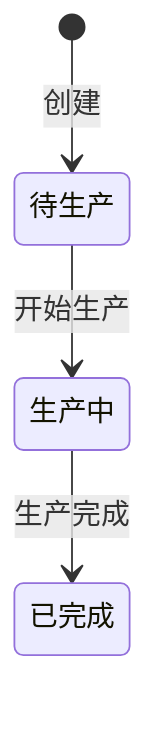
```mermaid
stateDiagram-v2
    [*] --> 待生产: 创建
    待生产 --> 生产中: 开始生产
    生产中 --> 已完成: 生产完成
```

| 状态 | 颜色 | 图标 | 甘特图条色 |
|---|---|---|---|
| 待生产 | `#f59e0b` 琥珀 | CircleIcon | `linear-gradient(90deg, #f59e0b, #fbbf24)` |
| 生产中 | `#38bdf8` 天蓝 | PlayCircleIcon | `linear-gradient(90deg, #0369a1, #38bdf8)` |
| 已完成 | `#4ade80` 绿色 | CheckCircleIcon | `linear-gradient(90deg, #166534, #4ade80)` |

### 3.4 审批状态

| 状态 | 颜色 | 图标 |
|---|---|---|
| 待审批 | `#fb923c` 橙色 | ClockIcon |
| 已通过 | `#34d399` 绿色 | CheckCircleIcon |
| 已拒绝 | `#f43f5e` 红色 | XCircleIcon |

### 3.5 工位状态

| 状态 | 颜色 | 图标 | 脉冲动画 |
|---|---|---|---|
| 运行中 | `#4ade80` 绿色 | ActivityIcon | 是（脉冲圆点） |
| 空闲 | `#94a3b8` 灰色 | PauseCircleIcon | 否 |
| 维护中 | `#a78bfa` 紫色 | WrenchIcon | 否 |
| 异常 | `#f43f5e` 红色 | AlertTriangleIcon | 是（脉冲圆点） |

### 3.6 通用状态视觉规范

所有状态标签遵循统一规范：
- **标签样式**：圆角矩形 `rounded-lg`，内含图标 + 文字
- **背景色**：状态色 + `15` 透明度（如 `#fb923c15`）
- **边框色**：状态色 + `25` 透明度（如 `#fb923c25`）
- **文字色**：状态色原色
- **图标**：10-12px，与文字同色
- **深色/浅色主题**：颜色值不变，通过透明度适配

---

## 四、交互细节

### 4.1 表单交互规则

| 规则 | 说明 |
|---|---|
| 验证时机 | 失焦时验证（onBlur），提交时全量验证 |
| 错误提示 | 字段下方红色文字 + 输入框边框变红 |
| 成功反馈 | toast 通知，2-3 秒自动消失 |
| 提交反馈 | 按钮变为 Loading 状态（旋转图标 + 文字变化） |
| 必填标识 | 字段标签后加红色星号 `*` |
| 禁用状态 | 管理员维护字段显示为只读（灰色背景 + 不可编辑） |
| 字符计数 | 个人简介等有长度限制的字段，右下角显示 `已输入/最大值` |

### 4.2 列表交互规则

| 规则 | 说明 |
|---|---|
| 排序 | 点击表头切换升序/降序，当前排序列高亮 + 箭头图标 |
| 筛选 | 搜索框 + 筛选按钮，搜索实时过滤（debounce 300ms） |
| 分页 | 底部分页器，默认每页 20 条，可选 10/20/50 |
| 批量操作 | 勾选后顶部显示批量操作栏（删除/导出/状态变更） |
| 行悬停 | 背景色微变（`rgba(56,189,248,0.04)`） |
| 行点击 | 跳转详情或展开详情面板 |
| 空列表 | 显示空状态插画 + 引导文字 |

### 4.3 弹窗/抽屉使用规则

| 场景 | 组件 | 宽度 | 说明 |
|---|---|---|---|
| 新建/编辑单据 | Drawer（右侧抽屉） | 560px | 可滚动，底部固定操作栏 |
| 确认操作 | AlertDialog | 400px | 居中弹窗，仅确认/取消 |
| 详情查看 | Drawer | 560-640px | 只读或含审批操作 |
| 简单表单 | Dialog | 480px | 居中弹窗 |
| 下拉选择 | Popover | 跟随触发元素 | 搜索下拉、日期选择等 |

**通用规则**：
- 弹窗/抽屉打开时背景遮罩（`rgba(0,0,0,0.5)` + `backdrop-filter: blur(4px)`）
- ESC 键关闭
- 点击遮罩关闭（确认弹窗除外）
- 打开/关闭动画：抽屉从右滑入 300ms，弹窗缩放淡入 200ms

### 4.4 拖拽交互规则（甘特图排程）

| 规则 | 说明 |
|---|---|
| 拖拽触发 | 鼠标按下工单条（mousedown） |
| 拖拽预览 | 实时更新位置，上方显示日期范围 Tooltip |
| 原位标记 | 拖拽时原位置显示虚线幽灵条 |
| 对齐方式 | 按天对齐（snap to day grid） |
| 冲突检测 | 拖拽过程中实时检测，冲突时预览位置变红 |
| 释放确认 | 无冲突 → 自动保存 + toast；有冲突 → 回弹 + 提示 |
| 禁止拖拽 | 已完成工单不可拖拽，cursor: not-allowed |
| 视觉反馈 | 拖拽条 scale(1.08) + 增强阴影 + 降低透明度 |

### 4.5 右键菜单规则

| 场景 | 菜单项 |
|---|---|
| 列表行右键 | 查看详情 / 编辑 / 复制单号 / 删除 |
| 甘特图工单条右键 | 查看详情 / 编辑工单 / 调整排程 / 取消工单 |
| 表格单元格右键 | 复制内容 |
| 通用 | 右键菜单使用 ContextMenu 组件，最多 6 个选项 |

---

## 五、数据展示模式

### 5.1 KPI 卡片设计规范

```
┌─────────────────────────────────┐
│  [图标]              [+15.4% ↑] │
│  ¥ 2,847,350                    │
│  本月销售额                      │
└─────────────────────────────────┘
```

| 元素 | 规范 |
|---|---|
| 容器 | glass-card，padding 16px，flex-1 等宽排列 |
| 图标 | 32×32 圆角方块，图标色背景 + 图标色图标 |
| 变化率 | 右上角，绿色↑/红色↓ + 百分比 |
| 数值 | 大字体加粗，font-mono，text-foreground |
| 标签 | 小字体，muted-foreground 色 |
| 悬停 | glass-card-hover 效果（上移 2px + 增强阴影） |

### 5.2 表格设计规范

| 元素 | 规范 |
|---|---|
| 容器 | glass-card，padding 20px |
| 表头 | 小号大写字母，tracking-wider，muted 色，底部分割线 |
| 行高 | py-3（12px 上下） |
| 行分割线 | 1px solid，极低透明度边框色 |
| 单号列 | font-mono，primary 色 |
| 金额列 | font-mono，cyan 色（`#22d3ee`） |
| 状态列 | 状态标签组件（图标 + 文字 + 彩色背景） |
| 悬停 | 行背景微变 |
| 空表格 | 居中空状态插画 + 文字 |

### 5.3 图表设计规范

| 图表类型 | 适用场景 | 配色 |
|---|---|---|
| 折线图 | 趋势数据（收入、产量） | 主色 `#818cf8`，渐变填充 |
| 柱状图 | 对比数据（月度销量） | 主色半透明，当前月高亮 |
| 面积图 | 累积趋势（现金流） | 收入绿 `#34d399`，支出红 `#f43f5e` |
| 饼图/环形图 | 占比数据（产能利用） | chart-1 到 chart-5 |
| 雷达图 | 多维评估（绩效） | chart-1 到 chart-5 |

**通用规范**：
- 网格线：虚线，极低透明度
- Tooltip：深色背景 + 边框 + 圆角，显示标签和数值
- 坐标轴：无轴线，刻度文字 muted 色
- 图表容器：glass-card，padding 20px
- 图表高度：200-240px
- 响应式：使用 ResponsiveContainer

### 5.4 空状态设计

| 场景 | 插画 | 文案 | 操作 |
|---|---|---|---|
| 无订单 | 订单图标（40px，低透明度） | "暂无订单数据" | "新建订单"按钮 |
| 无搜索结果 | 搜索图标 | "未找到匹配结果" | "清空搜索"链接 |
| 无通知 | 铃铛图标 | "暂无系统消息" | — |
| 无生产数据 | 工厂图标 | "暂无生产数据" | "创建工单"按钮 |

### 5.5 加载状态设计

| 场景 | 组件 | 说明 |
|---|---|---|
| 页面加载 | Skeleton 骨架屏 | 模拟页面布局，3 行卡片 + 表格骨架 |
| 按钮提交 | Loader2Icon 旋转 | 按钮内旋转图标 + 文字变化 |
| 表格加载 | 行内 Skeleton | 表格行显示脉冲动画条 |
| 图表加载 | 居中 Loader | 图表区域居中旋转图标 |
| 全局加载 | 顶部进度条 | 页面顶部 2px 渐变进度条 |

---

## 六、表单设计规则

### 6.1 必填项标识

- 必填字段标签后加红色星号 `*`，如 `供应商 *`
- 星号与标签文字间距 4px
- 底部统一提示："* 为必填项"

### 6.2 验证反馈方式

| 验证结果 | 视觉表现 |
|---|---|
| 未验证 | 默认边框色 |
| 验证通过 | 边框变为绿色（`rgba(52,211,153,0.5)`） |
| 验证失败 | 边框变为红色（`rgba(244,63,94,0.5)`），下方红色错误文字 |
| 聚焦 | 边框变为 primary 色（`rgba(129,140,248,0.5)`），ring 效果 |

### 6.3 表单布局规则

| 表单类型 | 布局 | 说明 |
|---|---|---|
| 简单表单（≤6 字段） | 单列 | 标签在输入框上方 |
| 中等表单（7-12 字段） | 双列 | 相关字段分组，每组单列 |
| 复杂表单（>12 字段） | 分步 + 分组 | 步骤条 + 每步分组 |

**分组规则**：
- 使用分割线或小标题分隔字段组
- 每组不超过 6 个字段
- 组间距 24px，字段间距 16px

### 6.4 大表单分步策略

- 步骤数：2-4 步
- 顶部步骤条显示当前步骤
- 每步有"上一步"/"下一步"按钮
- 最后一步显示"提交"按钮
- 支持步骤间自由切换（已完成的步骤可点击回退）

---

## 七、列表设计规则

### 7.1 列表筛选位置和方式

- **搜索框**：列表上方，全宽或固定宽度（200-300px），左侧搜索图标
- **状态筛选**：搜索框右侧，按钮组形式，选中高亮
- **高级筛选**：搜索框旁"筛选"按钮，点击展开筛选面板
- **Tab 切换**：页面级分类（如采购订单/供应商），顶部 Tab 按钮

### 7.2 排序规则

- 默认排序：按创建时间降序（最新在前）
- 可排序列：表头可点击，点击切换升序/降序
- 排序指示：当前排序列显示箭头图标（↑升序/↓降序）
- 多列排序：暂不支持，单列排序

### 7.3 分页规则

- 默认每页 20 条
- 可选：10 / 20 / 50 条
- 分页器位于列表底部
- 显示"共 N 条"总数
- 数据量 ≤ 50 条时不显示分页

### 7.4 批量操作规则

- 勾选方式：行首复选框
- 全选：表头复选框
- 选中后：顶部滑出批量操作栏，显示选中数量 + 操作按钮
- 批量操作：删除、导出、状态变更
- 危险操作（批量删除）需二次确认

---

## 八、错误处理

### 8.1 网络错误提示

| 场景 | 表现 |
|---|---|
| 请求超时 | toast 错误："请求超时，请重试" |
| 网络断开 | toast 错误："网络连接异常，请检查网络" |
| 服务器错误 | toast 错误："系统异常，请联系管理员" |
| 数据库查询超时 | 显示缓存数据 + toast 警告："数据可能不是最新" |

### 8.2 表单验证错误

| 场景 | 表现 |
|---|---|
| 必填为空 | 字段下方："请输入XXX" |
| 格式错误 | 字段下方："格式不正确，请输入有效的XXX" |
| 长度超限 | 字段下方："不能超过N个字符" |
| 范围错误 | 字段下方："请输入N-M之间的数值" |
| 不一致 | 字段下方："两次输入不一致" |

### 8.3 权限不足提示

| 场景 | 表现 |
|---|---|
| 访问无权限页面 | 403 页面，显示"您无权访问此页面" |
| 操作无权限 | toast 警告："您无权执行此操作" |
| 审批无权限 | toast 警告："您无权审批此金额的采购单" |
| 菜单隐藏 | 侧边栏不显示无权限菜单项 |

### 8.4 数据冲突提示

| 场景 | 表现 |
|---|---|
| 数据已被他人修改 | toast 警告："数据已被修改，请刷新后重试" |
| 唯一性冲突 | 字段下方："该XXX已存在" |
| 状态冲突 | toast 警告："该单据状态已变更，请刷新" |

### 8.5 操作失败重试

| 场景 | 表现 |
|---|---|
| 提交失败 | toast 错误 + "重试"按钮 |
| 保存失败 | toast 错误 + 自动保留草稿 |
| 导出失败 | toast 错误："导出失败，请重试" |
| 最大重试 | 3 次重试后停止，提示"操作持续失败，请联系管理员" |

---

## 九、响应式说明

### 9.1 最小分辨率 1280×720

- 所有页面以 1280×720 为最小设计基准
- 低于 1280px 宽度时，侧边栏自动折叠为图标模式（72px）
- 内容区域最小宽度 = 1280 - 72(侧边栏) - 64(顶栏) = 1144px

### 9.2 侧边栏折叠/展开

| 状态 | 宽度 | 显示内容 |
|---|---|---|
| 展开 | 240px | 图标 + 文字 + 角标 + 用户信息 |
| 折叠 | 72px | 仅图标 + 角标 |

- 折叠/展开切换：顶栏左侧菜单按钮
- 过渡动画：`width 0.3s ease`
- 折叠时：分组标签隐藏，文字隐藏，用户信息仅显示头像

### 9.3 内容区域自适应

- KPI 卡片行：flex 等宽，窄屏时换行（`flex-wrap: wrap`）
- 图表 + 侧边面板：窄屏时上下排列
- 表格：水平滚动（`overflow-x: auto`）
- 搜索框：flex-1，最小宽度 200px

---

## 十、动效参数

### 10.1 页面切换动效

| 参数 | 值 |
|---|---|
| 动画类型 | 淡入 + 微上移 |
| 持续时间 | 200ms |
| 缓动函数 | `ease-out` |
| 位移量 | translateY(8px) → translateY(0) |
| 透明度 | 0 → 1 |

### 10.2 弹窗/抽屉动效

| 组件 | 动画类型 | 持续时间 | 缓动函数 |
|---|---|---|---|
| Dialog | 缩放淡入 | 200ms | `cubic-bezier(0.16, 1, 0.3, 1)` |
| Drawer | 右侧滑入 | 300ms | `cubic-bezier(0.16, 1, 0.3, 1)` |
| AlertDialog | 缩放淡入 | 150ms | `ease-out` |
| 遮罩层 | 淡入 | 200ms | `ease` |

### 10.3 列表项动效

| 场景 | 动画 | 参数 |
|---|---|---|
| 列表项进入 | 依次淡入 | stagger 50ms，opacity 0→1，translateY(10px→0)，200ms |
| 列表项删除 | 淡出 + 收缩 | opacity 1→0，height auto→0，200ms |
| 列表项悬停 | 背景渐变 | background-color transition 150ms |

### 10.4 按钮点击反馈

| 状态 | 动画 | 参数 |
|---|---|---|
| 按下 | 缩小 | scale(0.97)，100ms |
| 释放 | 回弹 | scale(1)，150ms |
| 主要按钮悬停 | 上移 + 增强阴影 | translateY(-1px)，box-shadow 增强，200ms |
| Loading | 旋转图标 | Loader2Icon，`animate-spin`，1s linear infinite |

### 10.5 侧边栏导航动效

| 元素 | 动画 | 参数 |
|---|---|---|
| 活跃指示条 | 从左滑入 | `nav-bar-slide-in`，300ms，`cubic-bezier(0.22, 0.61, 0.36, 1)` |
| 光效扫过 | 从左到右扫光 | `nav-bar-glow-sweep`，400ms，延迟 30ms |
| 粒子拖尾 | 5 个粒子漂移 + 浮动 | `particle-drift-N` 200ms + `particle-float-N` 2.2-3.4s infinite |
| 悬停指示条 | 淡入 | opacity 0→1，150ms |
| 折叠/展开 | 宽度过渡 | width 240px↔72px，300ms ease |

**粒子参数**：
- 5 个粒子，大小 3-4px
- 颜色渐变：`#a78bfa` → `#7c3aed`（violet-400 → violet-700）
- 漂移方向：各粒子不同（上+左/上+右偏移）
- 浮动周期：2.2s - 3.4s 交错

### 10.6 主题切换动效

| 参数 | 值 |
|---|---|
| 切换按钮悬停 | scale(1.1) + rotate(15deg)，300ms，`cubic-bezier(0.34, 1.56, 0.64, 1)` |
| 图标旋转 | 360° 旋转，400ms，`ease both` |
| 主题过渡 | CSS 变量过渡，300ms，`transition: background-color 0.3s, color 0.3s, border-color 0.3s` |
| 极光动画 | 持续浮动，8s ease-in-out infinite |

### 10.7 其他动效

| 场景 | 动画 | 参数 |
|---|---|---|
| KPI 数值变化 | 数字滚动 | 计数动画，500ms |
| 进度条 | 从 0 增长 | `scaleY(0→1)`，600ms ease-out，transform-origin: bottom |
| Toast 通知 | 从右上滑入 | translateX(100%)→translateX(0)，300ms |
| 工位刷新 | 图标旋转 | `spin`，700ms linear |
| 仓库使用率条 | 宽度增长 | width transition，1000ms ease |

---

## 附录：设计系统色彩速查

### 状态色板

| 用途 | 色值 | CSS 变量 |
|---|---|---|
| 主色（紫） | `#818cf8` | `--primary` |
| 辅色（青） | `#22d3ee` | `--neon-secondary` |
| 成功（绿） | `#34d399` | — |
| 警告（橙） | `#fb923c` | — |
| 危险（红） | `#f43f5e` | `--destructive` |
| 信息（紫淡） | `#a78bfa` | `--neon-accent` |
| 中性灰 | `#8892b0` | `--muted-foreground` |
| 深灰 | `#4a5568` | — |

### 图表色板

| 序号 | 色值 | CSS 变量 |
|---|---|---|
| 1 | `#818cf8` | `--chart-1` |
| 2 | `#22d3ee` | `--chart-2` |
| 3 | `#a78bfa` | `--chart-3` |
| 4 | `#34d399` | `--chart-4` |
| 5 | `#fb923c` | `--chart-5` |

### 玻璃拟态参数

| 参数 | 深色主题 | 浅色主题 |
|---|---|---|
| 背景 | `rgba(255,255,255,0.04)` | `rgba(255,255,255,0.75)` |
| 边框 | `rgba(255,255,255,0.08)` | `rgba(99,102,241,0.14)` |
| 模糊 | `blur(20px) saturate(180%)` | `blur(20px) saturate(180%)` |
| 圆角 | `1rem` | `1rem` |


---

# 第二部分：技术设计

## 一、技术架构

### 1.1 整体架构图

```
┌─────────────────────────────────────────────────────────────────┐
│                     Electron 应用进程                            │
│                                                                 │
│  ┌──────────────────────────────────────────────────────────┐   │
│  │                    主进程 (Main Process)                   │   │
│  │                                                          │   │
│  │  ┌────────────┐  ┌────────────┐  ┌──────────────────┐   │   │
│  │  │ IPC Handler │  │ Auth Module │  │ Backup Scheduler │   │   │
│  │  └──────┬─────┘  └──────┬─────┘  └────────┬─────────┘   │   │
│  │         │               │                  │              │   │
│  │  ┌──────┴───────────────┴──────────────────┴─────────┐   │   │
│  │  │              Service Layer (业务逻辑)               │   │   │
│  │  │  AuthService / PurchaseService / SalesService /    │   │   │
│  │  │  InventoryService / ProductionService / ...        │   │   │
│  │  └──────────────────────┬────────────────────────────┘   │   │
│  │                         │                                │   │
│  │  ┌──────────────────────┴────────────────────────────┐   │   │
│  │  │              Data Access Layer (Drizzle ORM)       │   │   │
│  │  └──────────────────────┬────────────────────────────┘   │   │
│  │                         │                                │   │
│  │  ┌──────────────────────┴────────────────────────────┐   │   │
│  │  │              better-sqlite3 (WAL 模式)              │   │   │
│  │  └───────────────────────────────────────────────────┘   │   │
│  └──────────────────────────────────────────────────────────┘   │
│                            │ ipcMain/ipcRenderer               │
│  ┌──────────────────────────────────────────────────────────┐   │
│  │                  渲染进程 (Renderer Process)               │   │
│  │                                                          │   │
│  │  ┌────────────┐  ┌────────────┐  ┌──────────────────┐   │   │
│  │  │ React 19   │  │ Zustand    │  │ React Router     │   │   │
│  │  │ Pages      │  │ Stores     │  │ (导航守卫)        │   │   │
│  │  └──────┬─────┘  └──────┬─────┘  └────────┬─────────┘   │   │
│  │         │               │                  │              │   │
│  │  ┌──────┴───────────────┴──────────────────┴─────────┐   │   │
│  │  │          IPC Bridge (preload.ts 暴露的 API)         │   │   │
│  │  └───────────────────────────────────────────────────┘   │   │
│  │                                                          │   │
│  │  ┌────────────┐  ┌────────────┐  ┌──────────────────┐   │   │
│  │  │ Tailwind 4 │  │ shadcn/ui  │  │ Recharts         │   │   │
│  │  │ + Radix UI │  │ Components │  │ (图表)            │   │   │
│  │  └────────────┘  └────────────┘  └──────────────────┘   │   │
│  └──────────────────────────────────────────────────────────┘   │
│                                                                 │
│  ┌──────────────────────────────────────────────────────────┐   │
│  │                    共享层 (Shared)                         │   │
│  │  类型定义 / IPC 通道常量 / Zod Schema / 工具函数           │   │
│  └──────────────────────────────────────────────────────────┘   │
└─────────────────────────────────────────────────────────────────┘
```

### 1.2 目录结构设计

```
porcelain-erp/
├── electron.vite.config.ts          # electron-vite 配置
├── package.json
├── tsconfig.json
├── tsconfig.node.json
├── tsconfig.web.json
│
├── src/
│   ├── main/                        # Electron 主进程
│   │   ├── index.ts                 # 主进程入口
│   │   ├── ipc/                     # IPC 处理器注册
│   │   │   ├── index.ts             # 统一注册入口
│   │   │   ├── auth.ts              # 认证相关 IPC
│   │   │   ├── purchase.ts          # 采购模块 IPC
│   │   │   ├── sales.ts             # 销售模块 IPC
│   │   │   ├── inventory.ts         # 库存模块 IPC
│   │   │   ├── production.ts        # 生产模块 IPC
│   │   │   ├── finance.ts           # 财务模块 IPC
│   │   │   ├── hr.ts                # HR 模块 IPC
│   │   │   ├── report.ts            # 报表模块 IPC
│   │   │   ├── notification.ts      # 通知模块 IPC
│   │   │   ├── message.ts           # 消息模块 IPC
│   │   │   ├── log.ts               # 日志模块 IPC
│   │   │   ├── backup.ts            # 备份模块 IPC
│   │   │   └── settings.ts          # 设置模块 IPC
│   │   ├── services/                # 业务逻辑层
│   │   │   ├── auth.service.ts
│   │   │   ├── purchase.service.ts
│   │   │   ├── sales.service.ts
│   │   │   ├── inventory.service.ts
│   │   │   ├── production.service.ts
│   │   │   ├── finance.service.ts
│   │   │   ├── hr.service.ts
│   │   │   ├── report.service.ts
│   │   │   ├── notification.service.ts
│   │   │   ├── message.service.ts
│   │   │   ├── log.service.ts
│   │   │   ├── backup.service.ts
│   │   │   └── settings.service.ts
│   │   └── utils/                   # 主进程工具
│   │       ├── crypto.ts            # 加密工具（bcrypt/token）
│   │       ├── backup-scheduler.ts  # 备份定时任务
│   │       └── system-info.ts       # 系统信息采集
│   │
│   ├── preload/                     # Preload 脚本
│   │   ├── index.ts                 # preload 入口
│   │   └── api.ts                   # 暴露给渲染进程的 API
│   │
│   ├── renderer/                    # 渲染进程（React 应用）
│   │   ├── index.html               # HTML 入口
│   │   ├── main.tsx                 # React 入口
│   │   ├── App.tsx                  # 根组件（路由+Provider）
│   │   ├── routes/                  # 路由配置
│   │   │   └── index.tsx
│   │   ├── pages/                   # 页面组件
│   │   │   ├── LoginPage.tsx
│   │   │   ├── DashboardPage.tsx
│   │   │   ├── PurchasePage.tsx
│   │   │   ├── SalesPage.tsx
│   │   │   ├── InventoryPage.tsx
│   │   │   ├── FinancePage.tsx
│   │   │   ├── HrPage.tsx
│   │   │   ├── ReportsPage.tsx
│   │   │   ├── ProductionPlanPage.tsx
│   │   │   ├── WorkshopExecPage.tsx
│   │   │   ├── ProductionDashboardPage.tsx
│   │   │   ├── GenerationPage.tsx
│   │   │   ├── NotificationsPage.tsx
│   │   │   ├── MessagesPage.tsx
│   │   │   ├── ProfilePage.tsx
│   │   │   ├── SettingsPage.tsx
│   │   │   ├── OperationLogPage.tsx
│   │   │   ├── BackupRestorePage.tsx
│   │   │   └── NotFoundPage.tsx
│   │   ├── components/              # 组件
│   │   │   ├── layout/              # 布局组件
│   │   │   │   ├── AppLayout.tsx
│   │   │   │   ├── Sidebar.tsx
│   │   │   │   ├── TopBar.tsx
│   │   │   │   └── LockScreen.tsx
│   │   │   ├── shared/              # 共享业务组件
│   │   │   │   ├── KpiCardRow.tsx
│   │   │   │   ├── RevenueChart.tsx
│   │   │   │   ├── MiniDonutChart.tsx
│   │   │   │   ├── OrderTable.tsx
│   │   │   │   ├── ActivityFeed.tsx
│   │   │   │   ├── SystemStatus.tsx
│   │   │   │   └── LanguageSwitcher.tsx
│   │   │   └── ui/                  # shadcn/ui 基础组件（保持现有）
│   │   ├── stores/                  # Zustand Store
│   │   │   ├── auth.store.ts
│   │   │   ├── dashboard.store.ts
│   │   │   ├── purchase.store.ts
│   │   │   ├── sales.store.ts
│   │   │   ├── inventory.store.ts
│   │   │   ├── production.store.ts
│   │   │   ├── finance.store.ts
│   │   │   ├── hr.store.ts
│   │   │   ├── notification.store.ts
│   │   │   ├── message.store.ts
│   │   │   ├── settings.store.ts
│   │   │   └── ui.store.ts
│   │   ├── hooks/                   # 自定义 Hooks
│   │   │   ├── useAuth.ts
│   │   │   ├── useIpc.ts
│   │   │   ├── usePermission.ts
│   │   │   └── useTheme.ts
│   │   ├── i18n/                    # 国际化
│   │   │   ├── index.ts
│   │   │   ├── zh-CN.ts
│   │   │   ├── en-US.ts
│   │   │   ├── ja-JP.ts
│   │   │   ├── ko-KR.ts
│   │   │   ├── de-DE.ts
│   │   │   └── fr-FR.ts
│   │   ├── lib/                     # 工具库
│   │   │   ├── ipc.ts               # IPC 调用封装
│   │   │   ├── utils.ts             # 通用工具
│   │   │   └── validators.ts        # Zod 验证 Schema
│   │   └── index.css                # 全局样式
│   │
│   ├── shared/                      # 主进程与渲染进程共享
│   │   ├── types/                   # 共享类型定义
│   │   │   ├── index.ts
│   │   │   ├── auth.ts
│   │   │   ├── purchase.ts
│   │   │   ├── sales.ts
│   │   │   ├── inventory.ts
│   │   │   ├── production.ts
│   │   │   ├── finance.ts
│   │   │   ├── hr.ts
│   │   │   ├── notification.ts
│   │   │   ├── message.ts
│   │   │   └── common.ts
│   │   ├── constants/               # 共享常量
│   │   │   ├── ipc-channels.ts      # IPC 通道名定义
│   │   │   └── enums.ts             # 枚举常量
│   │   └── schemas/                 # Zod 验证 Schema
│   │       ├── auth.schema.ts
│   │       ├── purchase.schema.ts
│   │       ├── sales.schema.ts
│   │       ├── inventory.schema.ts
│   │       ├── production.schema.ts
│   │       ├── finance.schema.ts
│   │       └── hr.schema.ts
│   │
│   └── db/                          # 数据库层
│       ├── index.ts                 # 数据库初始化 + 连接
│       ├── schema/                  # Drizzle Schema 定义
│       │   ├── index.ts             # 统一导出
│       │   ├── user.ts
│       │   ├── role.ts
│       │   ├── permission.ts
│       │   ├── supplier.ts
│       │   ├── purchase-order.ts
│       │   ├── purchase-order-item.ts
│       │   ├── customer.ts
│       │   ├── sales-order.ts
│       │   ├── sales-order-item.ts
│       │   ├── product.ts
│       │   ├── inventory-item.ts
│       │   ├── inventory-transaction.ts
│       │   ├── warehouse.ts
│       │   ├── work-order.ts
│       │   ├── work-station.ts
│       │   ├── process-card.ts
│       │   ├── report-record.ts
│       │   ├── finance-transaction.ts
│       │   ├── employee.ts
│       │   ├── department.ts
│       │   ├── operation-log.ts
│       │   ├── backup-record.ts
│       │   ├── notification.ts
│       │   ├── approval-item.ts
│       │   ├── chat-message.ts
│       │   ├── report.ts
│       │   └── system-settings.ts
│       ├── migrate/                 # 迁移文件
│       │   └── 0001_initial.sql
│       └── seed/                    # 种子数据
│           └── initial-data.ts
│
├── resources/                       # Electron 资源
│   └── icon.png                     # 应用图标
│
└── docs/                            # 文档
    ├── prd.md
    ├── design.md
    ├── dev-tasks.md
    ├── dev-notes.md
    └── bug-fix.md
```

### 1.3 IPC 通信架构

#### 通信模式

采用 **请求-响应模式**（invoke/handle），所有 IPC 通信使用 `ipcRenderer.invoke` + `ipcMain.handle`，返回 `Promise`。

```
渲染进程                              主进程
   │                                    │
   │  ipcRenderer.invoke(channel, args) │
   │ ──────────────────────────────────►│
   │                                    │  执行 Service 逻辑
   │                                    │  操作数据库
   │  ◄──────────────────────────────────│
   │  Promise<IpcResult<T>>             │
   │                                    │
```

#### 统一响应格式

```typescript
// src/shared/types/common.ts
interface IpcResult<T = unknown> {
  success: boolean;
  data?: T;
  error?: {
    code: string;
    message: string;
  };
}
```

#### 通道命名规范

```
{模块}:{操作}

模块：auth / role / permission / purchase / supplier / sales / customer /
      inventory / warehouse / production / work-station / process-card /
      report-record / finance / employee / department / notification /
      approval / message / log / backup / report / settings / dashboard

操作：list / get / create / update / delete / approve / reject /
      lock / unlock / login / logout / search / export / import /
      count / stats / dashboard
```

示例：
- `auth:login` — 用户登录
- `purchase:list` — 采购单列表
- `purchase:create` — 创建采购单
- `inventory:stats` — 库存统计

#### Preload 暴露 API

```typescript
// src/preload/api.ts
const api = {
  invoke: (channel: string, ...args: unknown[]) => {
    // 白名单校验
    const allowedChannels = IPC_CHANNELS;
    if (!allowedChannels.includes(channel)) {
      throw new Error(`IPC channel not allowed: ${channel}`);
    }
    return ipcRenderer.invoke(channel, ...args);
  },

  // 事件监听（主进程 → 渲染进程推送）
  on: (channel: string, callback: (...args: unknown[]) => void) => {
    const allowedEvents = ['notification:new', 'lock:screen', 'backup:progress'];
    if (!allowedEvents.includes(channel)) return;
    const listener = (_event: IpcRendererEvent, ...args: unknown[]) => callback(...args);
    ipcRenderer.on(channel, listener);
    return () => ipcRenderer.removeListener(channel, listener);
  },
};
```

### 1.4 状态管理架构

#### Zustand Store 拆分策略

按业务模块拆分 Store，每个 Store 职责单一：

```
┌──────────────────────────────────────────────┐
│              渲染进程 Zustand Stores           │
│                                              │
│  authStore ──── 用户信息/登录状态/权限         │
│  uiStore ────── 主题/侧边栏/锁屏/语言         │
│  dashboardStore ── KPI数据/图表数据           │
│  purchaseStore ── 采购单/供应商数据           │
│  salesStore ──── 销售单/客户数据              │
│  inventoryStore ── 库存/仓库数据              │
│  productionStore ── 工单/工位/报工数据        │
│  financeStore ── 财务/流水数据                │
│  hrStore ────── 员工/部门数据                 │
│  notificationStore ── 通知/审批数据           │
│  messageStore ── 消息/联系人数据              │
│  settingsStore ── 系统设置数据                │
└──────────────────────────────────────────────┘
         │
         │ invoke IPC
         ▼
┌──────────────────────────────────────────────┐
│              主进程 Services                  │
│         (数据源：SQLite via Drizzle)          │
└──────────────────────────────────────────────┘
```

#### 数据流模式

```
用户操作 → Store Action → ipcRenderer.invoke → ipcMain.handle → Service → Drizzle → SQLite
                                    │
                                    ▼ 返回 IpcResult<T>
Store 更新 state ← Action 处理响应 ←
```

---

## 二、数据模型（Drizzle Schema）

### 2.1 数据库配置

```typescript
// src/db/index.ts
import Database from 'better-sqlite3';
import { drizzle } from 'drizzle-orm/better-sqlite3';
import * as schema from './schema';
import { app } from 'electron';
import path from 'path';

const dbPath = path.join(app.getPath('userData'), 'porcelain-erp.db');
const sqlite = new Database(dbPath);

// WAL 模式提升并发读性能
sqlite.pragma('journal_mode = WAL');
sqlite.pragma('foreign_keys = ON');
sqlite.pragma('synchronous = NORMAL');
sqlite.pragma('cache_size = -64000'); // 64MB 缓存
sqlite.pragma('busy_timeout = 5000');

export const db = drizzle(sqlite, { schema });
export { sqlite };
```

### 2.2 完整 Schema 定义

```typescript
// src/db/schema/index.ts
export * from './user';
export * from './role';
export * from './permission';
export * from './department';
export * from './supplier';
export * from './purchase-order';
export * from './purchase-order-item';
export * from './customer';
export * from './sales-order';
export * from './sales-order-item';
export * from './product';
export * from './warehouse';
export * from './inventory-item';
export * from './inventory-transaction';
export * from './work-order';
export * from './work-station';
export * from './process-card';
export * from './report-record';
export * from './finance-transaction';
export * from './employee';
export * from './operation-log';
export * from './backup-record';
export * from './notification';
export * from './approval-item';
export * from './chat-message';
export * from './report';
export * from './system-settings';
```

```typescript
// src/db/schema/role.ts
import { sqliteTable, text, integer } from 'drizzle-orm/sqlite-core';

export const roles = sqliteTable('roles', {
  id: integer('id').primaryKey({ autoIncrement: true }),
  name: text('name').notNull().unique(),
  description: text('description'),
  isSystem: integer('is_system', { mode: 'boolean' }).notNull().default(false),
  createdAt: integer('created_at', { mode: 'timestamp' }).notNull().$defaultFn(() => new Date()),
  updatedAt: integer('updated_at', { mode: 'timestamp' }).notNull().$defaultFn(() => new Date()),
});
```

```typescript
// src/db/schema/permission.ts
import { sqliteTable, text, integer } from 'drizzle-orm/sqlite-core';

export const permissions = sqliteTable('permissions', {
  id: integer('id').primaryKey({ autoIncrement: true }),
  resource: text('resource').notNull(),       // 页面/模块标识
  action: text('action').notNull(),           // view/create/edit/delete/approve/export
  description: text('description'),
});

// 角色-权限关联表
export const rolePermissions = sqliteTable('role_permissions', {
  roleId: integer('role_id').notNull().references(() => roles.id, { onDelete: 'cascade' }),
  permissionId: integer('permission_id').notNull().references(() => permissions.id, { onDelete: 'cascade' }),
});
```

```typescript
// src/db/schema/user.ts
import { sqliteTable, text, integer } from 'drizzle-orm/sqlite-core';
import { roles } from './role';
import { departments } from './department';

export const users = sqliteTable('users', {
  id: integer('id').primaryKey({ autoIncrement: true }),
  username: text('username').notNull().unique(),
  passwordHash: text('password_hash').notNull(),
  name: text('name').notNull(),
  email: text('email'),
  phone: text('phone'),
  avatar: text('avatar'),                     // 头像文件路径
  bio: text('bio'),
  deptId: integer('dept_id').references(() => departments.id),
  position: text('position'),                 // 职位
  status: text('status', { enum: ['active', 'locked', 'disabled'] }).notNull().default('active'),
  loginAttempts: integer('login_attempts').notNull().default(0),
  lockedUntil: integer('locked_until', { mode: 'timestamp' }),
  lastLoginAt: integer('last_login_at', { mode: 'timestamp' }),
  lastLoginIp: text('last_login_ip'),
  passwordChangedAt: integer('password_changed_at', { mode: 'timestamp' }),
  joinDate: integer('join_date', { mode: 'timestamp' }),
  createdAt: integer('created_at', { mode: 'timestamp' }).notNull().$defaultFn(() => new Date()),
  updatedAt: integer('updated_at', { mode: 'timestamp' }).notNull().$defaultFn(() => new Date()),
});

// 用户-角色关联表
export const userRoles = sqliteTable('user_roles', {
  userId: integer('user_id').notNull().references(() => users.id, { onDelete: 'cascade' }),
  roleId: integer('role_id').notNull().references(() => roles.id, { onDelete: 'cascade' }),
});
```

```typescript
// src/db/schema/department.ts
import { sqliteTable, text, integer } from 'drizzle-orm/sqlite-core';

export const departments = sqliteTable('departments', {
  id: integer('id').primaryKey({ autoIncrement: true }),
  name: text('name').notNull().unique(),
  parentId: integer('parent_id'),             // 上级部门（自引用）
  managerId: integer('manager_id').references(() => users.id),
  description: text('description'),
  createdAt: integer('created_at', { mode: 'timestamp' }).notNull().$defaultFn(() => new Date()),
});
```

```typescript
// src/db/schema/supplier.ts
import { sqliteTable, text, integer, real } from 'drizzle-orm/sqlite-core';

export const suppliers = sqliteTable('suppliers', {
  id: integer('id').primaryKey({ autoIncrement: true }),
  name: text('name').notNull().unique(),
  category: text('category').notNull(),       // 供应商类别
  contactPerson: text('contact_person'),
  contactPhone: text('contact_phone'),
  address: text('address'),
  rating: real('rating').notNull().default(0), // 1.0-5.0
  deliveryRate: real('delivery_rate'),         // 交货准时率
  qualityRate: real('quality_rate'),           // 质量合格率
  status: text('status', { enum: ['active', 'reviewing', 'disabled'] }).notNull().default('active'),
  createdAt: integer('created_at', { mode: 'timestamp' }).notNull().$defaultFn(() => new Date()),
  updatedAt: integer('updated_at', { mode: 'timestamp' }).notNull().$defaultFn(() => new Date()),
});
```

```typescript
// src/db/schema/purchase-order.ts
import { sqliteTable, text, integer, real } from 'drizzle-orm/sqlite-core';
import { suppliers } from './supplier';
import { users } from './user';

export const purchaseOrders = sqliteTable('purchase_orders', {
  id: integer('id').primaryKey({ autoIncrement: true }),
  orderNo: text('order_no').notNull().unique(), // PO-YYYY-NNN
  supplierId: integer('supplier_id').notNull().references(() => suppliers.id),
  totalAmount: real('total_amount').notNull().default(0),
  status: text('status', {
    enum: ['draft', 'pending_approval', 'approved', 'purchasing', 'in_transit', 'arrived', 'warehoused', 'completed', 'cancelled'],
  }).notNull().default('draft'),
  priority: text('priority', { enum: ['high', 'medium', 'low'] }).notNull().default('medium'),
  createdById: integer('created_by_id').notNull().references(() => users.id),
  approvedById: integer('approved_by_id').references(() => users.id),
  approvedAt: integer('approved_at', { mode: 'timestamp' }),
  expectedDate: integer('expected_date', { mode: 'timestamp' }),
  notes: text('notes'),
  archivedAt: integer('archived_at', { mode: 'timestamp' }), // 草稿超30天归档
  createdAt: integer('created_at', { mode: 'timestamp' }).notNull().$defaultFn(() => new Date()),
  updatedAt: integer('updated_at', { mode: 'timestamp' }).notNull().$defaultFn(() => new Date()),
});
```

```typescript
// src/db/schema/purchase-order-item.ts
import { sqliteTable, text, integer, real } from 'drizzle-orm/sqlite-core';
import { purchaseOrders } from './purchase-order';
import { products } from './product';

export const purchaseOrderItems = sqliteTable('purchase_order_items', {
  id: integer('id').primaryKey({ autoIncrement: true }),
  orderId: integer('order_id').notNull().references(() => purchaseOrders.id, { onDelete: 'cascade' }),
  productId: integer('product_id').notNull().references(() => products.id),
  quantity: integer('quantity').notNull(),
  unitPrice: real('unit_price').notNull(),
  totalPrice: real('total_price').notNull(),
  receivedQty: integer('received_qty').notNull().default(0), // 实际到货数量
  notes: text('notes'),
});
```

```typescript
// src/db/schema/customer.ts
import { sqliteTable, text, integer, real } from 'drizzle-orm/sqlite-core';

export const customers = sqliteTable('customers', {
  id: integer('id').primaryKey({ autoIncrement: true }),
  name: text('name').notNull().unique(),
  tier: text('tier', { enum: ['diamond', 'platinum', 'gold', 'normal'] }).notNull().default('normal'),
  contactPerson: text('contact_person'),
  contactPhone: text('contact_phone'),
  email: text('email'),
  address: text('address'),
  creditLimit: real('credit_limit').notNull().default(0), // 信用额度，0=不限
  annualAmount: real('annual_amount').notNull().default(0), // 年度交易额
  status: text('status', { enum: ['active', 'disabled'] }).notNull().default('active'),
  createdAt: integer('created_at', { mode: 'timestamp' }).notNull().$defaultFn(() => new Date()),
  updatedAt: integer('updated_at', { mode: 'timestamp' }).notNull().$defaultFn(() => new Date()),
});
```

```typescript
// src/db/schema/sales-order.ts
import { sqliteTable, text, integer, real } from 'drizzle-orm/sqlite-core';
import { customers } from './customer';
import { users } from './user';

export const salesOrders = sqliteTable('sales_orders', {
  id: integer('id').primaryKey({ autoIncrement: true }),
  orderNo: text('order_no').notNull().unique(), // SO-YYYY-NNN
  customerId: integer('customer_id').notNull().references(() => customers.id),
  totalAmount: real('total_amount').notNull().default(0),
  status: text('status', {
    enum: ['draft', 'pending_approval', 'approved', 'processing', 'shipped', 'completed', 'cancelled'],
  }).notNull().default('draft'),
  createdById: integer('created_by_id').notNull().references(() => users.id),
  approvedById: integer('approved_by_id').references(() => users.id),
  approvedAt: integer('approved_at', { mode: 'timestamp' }),
  shippedAt: integer('shipped_at', { mode: 'timestamp' }),
  notes: text('notes'),
  createdAt: integer('created_at', { mode: 'timestamp' }).notNull().$defaultFn(() => new Date()),
  updatedAt: integer('updated_at', { mode: 'timestamp' }).notNull().$defaultFn(() => new Date()),
});
```

```typescript
// src/db/schema/sales-order-item.ts
import { sqliteTable, text, integer, real } from 'drizzle-orm/sqlite-core';
import { salesOrders } from './sales-order';
import { products } from './product';

export const salesOrderItems = sqliteTable('sales_order_items', {
  id: integer('id').primaryKey({ autoIncrement: true }),
  orderId: integer('order_id').notNull().references(() => salesOrders.id, { onDelete: 'cascade' }),
  productId: integer('product_id').notNull().references(() => products.id),
  quantity: integer('quantity').notNull(),
  unitPrice: real('unit_price').notNull(),
  totalPrice: real('total_price').notNull(),
  notes: text('notes'),
});
```

```typescript
// src/db/schema/product.ts
import { sqliteTable, text, integer, real } from 'drizzle-orm/sqlite-core';

export const products = sqliteTable('products', {
  id: integer('id').primaryKey({ autoIncrement: true }),
  name: text('name').notNull(),
  sku: text('sku').notNull().unique(),
  category: text('category').notNull(),
  unit: text('unit').notNull().default('个'),
  price: real('price').notNull().default(0),
  minStock: integer('min_stock').notNull().default(0), // 最低库存
  description: text('description'),
  status: text('status', { enum: ['active', 'disabled'] }).notNull().default('active'),
  createdAt: integer('created_at', { mode: 'timestamp' }).notNull().$defaultFn(() => new Date()),
  updatedAt: integer('updated_at', { mode: 'timestamp' }).notNull().$defaultFn(() => new Date()),
});
```

```typescript
// src/db/schema/warehouse.ts
import { sqliteTable, text, integer, real } from 'drizzle-orm/sqlite-core';

export const warehouses = sqliteTable('warehouses', {
  id: integer('id').primaryKey({ autoIncrement: true }),
  name: text('name').notNull().unique(),
  area: real('area'),                         // 面积（m²）
  usedRatio: real('used_ratio').notNull().default(0), // 使用率百分比
  categoryCount: integer('category_count').notNull().default(0),
  status: text('status', { enum: ['active', 'disabled'] }).notNull().default('active'),
  createdAt: integer('created_at', { mode: 'timestamp' }).notNull().$defaultFn(() => new Date()),
});
```

```typescript
// src/db/schema/inventory-item.ts
import { sqliteTable, text, integer, real } from 'drizzle-orm/sqlite-core';
import { products } from './product';
import { warehouses } from './warehouse';

export const inventoryItems = sqliteTable('inventory_items', {
  id: integer('id').primaryKey({ autoIncrement: true }),
  productId: integer('product_id').notNull().references(() => products.id),
  warehouseId: integer('warehouse_id').notNull().references(() => warehouses.id),
  stock: integer('stock').notNull().default(0),
  minStock: integer('min_stock').notNull().default(0),
  unitPrice: real('unit_price').notNull().default(0),
  updatedAt: integer('updated_at', { mode: 'timestamp' }).notNull().$defaultFn(() => new Date()),
});
```

```typescript
// src/db/schema/inventory-transaction.ts
import { sqliteTable, text, integer } from 'drizzle-orm/sqlite-core';
import { products } from './product';
import { warehouses } from './warehouse';
import { users } from './user';

export const inventoryTransactions = sqliteTable('inventory_transactions', {
  id: integer('id').primaryKey({ autoIncrement: true }),
  type: text('type', { enum: ['in', 'out'] }).notNull(),
  productId: integer('product_id').notNull().references(() => products.id),
  warehouseId: integer('warehouse_id').notNull().references(() => warehouses.id),
  quantity: integer('quantity').notNull(),
  relatedOrderType: text('related_order_type'), // purchase_order / sales_order / adjustment
  relatedOrderId: integer('related_order_id'),
  operatorId: integer('operator_id').notNull().references(() => users.id),
  notes: text('notes'),
  createdAt: integer('created_at', { mode: 'timestamp' }).notNull().$defaultFn(() => new Date()),
});
```

```typescript
// src/db/schema/work-order.ts
import { sqliteTable, text, integer } from 'drizzle-orm/sqlite-core';
import { products } from './product';
import { users } from './user';

export const workOrders = sqliteTable('work_orders', {
  id: integer('id').primaryKey({ autoIncrement: true }),
  orderNo: text('order_no').notNull().unique(), // WO-YYYY-NNN
  name: text('name').notNull(),
  productId: integer('product_id').notNull().references(() => products.id),
  plannedQty: integer('planned_qty').notNull(),
  completedQty: integer('completed_qty').notNull().default(0),
  defectQty: integer('defect_qty').notNull().default(0),
  unit: text('unit').notNull().default('个'),
  status: text('status', { enum: ['pending', 'in_progress', 'completed'] }).notNull().default('pending'),
  priority: text('priority', { enum: ['high', 'medium', 'low'] }).notNull().default('medium'),
  workshop: text('workshop').notNull(),
  progress: integer('progress').notNull().default(0), // 0-100
  startDate: integer('start_date', { mode: 'timestamp' }).notNull(),
  endDate: integer('end_date', { mode: 'timestamp' }).notNull(),
  createdById: integer('created_by_id').notNull().references(() => users.id),
  notes: text('notes'),
  createdAt: integer('created_at', { mode: 'timestamp' }).notNull().$defaultFn(() => new Date()),
  updatedAt: integer('updated_at', { mode: 'timestamp' }).notNull().$defaultFn(() => new Date()),
});
```

```typescript
// src/db/schema/work-station.ts
import { sqliteTable, text, integer, real } from 'drizzle-orm/sqlite-core';
import { users } from './user';

export const workStations = sqliteTable('work_stations', {
  id: integer('id').primaryKey({ autoIncrement: true }),
  name: text('name').notNull(),
  type: text('type').notNull(),               // 工位类型
  operatorId: integer('operator_id').references(() => users.id),
  currentJob: text('current_job'),            // 当前任务描述
  status: text('status', { enum: ['running', 'idle', 'maintenance', 'warning'] }).notNull().default('idle'),
  efficiency: real('efficiency').notNull().default(0),
  temperature: real('temperature').notNull().default(0), // 温度
  load: real('load').notNull().default(0),    // 负载百分比
  updatedAt: integer('updated_at', { mode: 'timestamp' }).notNull().$defaultFn(() => new Date()),
});
```

```typescript
// src/db/schema/process-card.ts
import { sqliteTable, text, integer } from 'drizzle-orm/sqlite-core';
import { workOrders } from './work-order';
import { workStations } from './work-station';

export const processCards = sqliteTable('process_cards', {
  id: integer('id').primaryKey({ autoIncrement: true }),
  workOrderId: integer('work_order_id').notNull().references(() => workOrders.id, { onDelete: 'cascade' }),
  seq: integer('seq').notNull(),              // 工序顺序
  name: text('name').notNull(),               // 工序名称
  status: text('status', { enum: ['pending', 'in_progress', 'completed'] }).notNull().default('pending'),
  plannedDuration: integer('planned_duration'), // 计划时长（分钟）
  actualDuration: integer('actual_duration'),   // 实际时长（分钟）
  stationId: integer('station_id').references(() => workStations.id),
  note: text('note'),
  startedAt: integer('started_at', { mode: 'timestamp' }),
  completedAt: integer('completed_at', { mode: 'timestamp' }),
});
```

```typescript
// src/db/schema/report-record.ts
import { sqliteTable, text, integer } from 'drizzle-orm/sqlite-core';
import { workOrders } from './work-order';
import { workStations } from './work-station';
import { users } from './user';

export const reportRecords = sqliteTable('report_records', {
  id: integer('id').primaryKey({ autoIncrement: true }),
  workOrderId: integer('work_order_id').notNull().references(() => workOrders.id),
  stationId: integer('station_id').notNull().references(() => workStations.id),
  operatorId: integer('operator_id').notNull().references(() => users.id),
  completedQty: integer('completed_qty').notNull(),
  defectQty: integer('defect_qty').notNull().default(0),
  note: text('note'),
  createdAt: integer('created_at', { mode: 'timestamp' }).notNull().$defaultFn(() => new Date()),
});
```

```typescript
// src/db/schema/finance-transaction.ts
import { sqliteTable, text, integer, real } from 'drizzle-orm/sqlite-core';
import { users } from './user';

export const financeTransactions = sqliteTable('finance_transactions', {
  id: integer('id').primaryKey({ autoIncrement: true }),
  transactionNo: text('transaction_no').notNull().unique(), // 流水号
  type: text('type', { enum: ['income', 'expense'] }).notNull(),
  amount: real('amount').notNull(),
  description: text('description').notNull(),
  method: text('method'),                    // 支付方式
  relatedOrderType: text('related_order_type'), // purchase_order / sales_order
  relatedOrderId: integer('related_order_id'),
  operatorId: integer('operator_id').notNull().references(() => users.id),
  transactionDate: integer('transaction_date', { mode: 'timestamp' }).notNull(),
  createdAt: integer('created_at', { mode: 'timestamp' }).notNull().$defaultFn(() => new Date()),
});
```

```typescript
// src/db/schema/employee.ts
import { sqliteTable, text, integer, real } from 'drizzle-orm/sqlite-core';
import { departments } from './department';

export const employees = sqliteTable('employees', {
  id: integer('id').primaryKey({ autoIncrement: true }),
  userId: integer('user_id').references(() => users.id), // 关联系统用户（可选）
  name: text('name').notNull(),
  position: text('position').notNull(),       // 职位/角色
  deptId: integer('dept_id').notNull().references(() => departments.id),
  email: text('email').unique(),
  phone: text('phone').unique(),
  salary: real('salary'),                     // 薪资（敏感字段）
  status: text('status', { enum: ['active', 'business_trip', 'on_leave', 'resigned'] }).notNull().default('active'),
  joinDate: integer('join_date', { mode: 'timestamp' }).notNull(),
  leaveDate: integer('leave_date', { mode: 'timestamp' }),
  avatar: text('avatar'),
  createdAt: integer('created_at', { mode: 'timestamp' }).notNull().$defaultFn(() => new Date()),
  updatedAt: integer('updated_at', { mode: 'timestamp' }).notNull().$defaultFn(() => new Date()),
});
```

```typescript
// src/db/schema/operation-log.ts
import { sqliteTable, text, integer } from 'drizzle-orm/sqlite-core';
import { users } from './user';

export const operationLogs = sqliteTable('operation_logs', {
  id: integer('id').primaryKey({ autoIncrement: true }),
  userId: integer('user_id').notNull().references(() => users.id),
  action: text('action').notNull(),           // 操作内容
  module: text('module').notNull(),           // 所属模块
  detail: text('detail'),                     // 详细描述
  ip: text('ip'),                             // 来源 IP
  level: text('level', { enum: ['info', 'success', 'warning', 'error'] }).notNull().default('info'),
  duration: integer('duration'),              // 耗时（ms）
  createdAt: integer('created_at', { mode: 'timestamp' }).notNull().$defaultFn(() => new Date()),
});
```

```typescript
// src/db/schema/backup-record.ts
import { sqliteTable, text, integer, real } from 'drizzle-orm/sqlite-core';

export const backupRecords = sqliteTable('backup_records', {
  id: integer('id').primaryKey({ autoIncrement: true }),
  name: text('name').notNull(),
  filePath: text('file_path').notNull(),      // 备份文件路径
  size: real('size').notNull().default(0),     // 文件大小（MB）
  type: text('type', { enum: ['full', 'incremental', 'differential'] }).notNull(),
  status: text('status', { enum: ['completed', 'running', 'failed', 'scheduled'] }).notNull().default('scheduled'),
  modules: text('modules'),                   // 包含模块（JSON 数组字符串）
  scheduledAt: integer('scheduled_at', { mode: 'timestamp' }),
  completedAt: integer('completed_at', { mode: 'timestamp' }),
  error: text('error'),                       // 失败原因
  createdAt: integer('created_at', { mode: 'timestamp' }).notNull().$defaultFn(() => new Date()),
});
```

```typescript
// src/db/schema/notification.ts
import { sqliteTable, text, integer } from 'drizzle-orm/sqlite-core';
import { users } from './user';

export const notifications = sqliteTable('notifications', {
  id: integer('id').primaryKey({ autoIncrement: true }),
  type: text('type', { enum: ['info', 'warning', 'success', 'error', 'approval'] }).notNull(),
  title: text('title').notNull(),
  content: text('content'),
  senderId: integer('sender_id').references(() => users.id), // 发送者（系统通知为空）
  userId: integer('user_id').notNull().references(() => users.id, { onDelete: 'cascade' }),
  isRead: integer('is_read', { mode: 'boolean' }).notNull().default(false),
  createdAt: integer('created_at', { mode: 'timestamp' }).notNull().$defaultFn(() => new Date()),
});
```

```typescript
// src/db/schema/approval-item.ts
import { sqliteTable, text, integer, real } from 'drizzle-orm/sqlite-core';
import { users } from './user';

export const approvalItems = sqliteTable('approval_items', {
  id: integer('id').primaryKey({ autoIncrement: true }),
  title: text('title').notNull(),
  type: text('type', { enum: ['purchase', 'travel', 'asset', 'hr', 'budget', 'leave'] }).notNull(),
  submitterId: integer('submitter_id').notNull().references(() => users.id),
  deptId: integer('dept_id').references(() => departments.id),
  amount: real('amount'),                     // 涉及金额
  status: text('status', { enum: ['pending', 'approved', 'rejected'] }).notNull().default('pending'),
  priority: text('priority', { enum: ['high', 'medium', 'low'] }).notNull().default('medium'),
  description: text('description'),
  relatedOrderType: text('related_order_type'),
  relatedOrderId: integer('related_order_id'),
  approverId: integer('approver_id').references(() => users.id),
  approvedAt: integer('approved_at', { mode: 'timestamp' }),
  approvalNote: text('approval_note'),        // 审批说明
  createdAt: integer('created_at', { mode: 'timestamp' }).notNull().$defaultFn(() => new Date()),
  updatedAt: integer('updated_at', { mode: 'timestamp' }).notNull().$defaultFn(() => new Date()),
});
```

```typescript
// src/db/schema/chat-message.ts
import { sqliteTable, text, integer } from 'drizzle-orm/sqlite-core';
import { users } from './user';

export const chatMessages = sqliteTable('chat_messages', {
  id: integer('id').primaryKey({ autoIncrement: true }),
  fromId: integer('from_id').notNull().references(() => users.id),
  toId: integer('to_id').notNull().references(() => users.id),
  content: text('content').notNull(),
  type: text('type', { enum: ['text', 'image', 'file'] }).notNull().default('text'),
  isRead: integer('is_read', { mode: 'boolean' }).notNull().default(false),
  createdAt: integer('created_at', { mode: 'timestamp' }).notNull().$defaultFn(() => new Date()),
});
```

```typescript
// src/db/schema/report.ts
import { sqliteTable, text, integer, real } from 'drizzle-orm/sqlite-core';

export const reports = sqliteTable('reports', {
  id: integer('id').primaryKey({ autoIncrement: true }),
  name: text('name').notNull(),
  type: text('type', { enum: ['financial', 'sales', 'inventory', 'performance', 'supplier'] }).notNull(),
  filePath: text('file_path'),                // 生成文件路径
  fileSize: real('file_size').default(0),
  status: text('status', { enum: ['generated', 'generating'] }).notNull().default('generating'),
  dateRange: text('date_range'),              // 日期范围描述
  generatedAt: integer('generated_at', { mode: 'timestamp' }),
  createdAt: integer('created_at', { mode: 'timestamp' }).notNull().$defaultFn(() => new Date()),
});
```

```typescript
// src/db/schema/system-settings.ts
import { sqliteTable, text, integer } from 'drizzle-orm/sqlite-core';

export const systemSettings = sqliteTable('system_settings', {
  id: integer('id').primaryKey({ autoIncrement: true }),
  key: text('key').notNull().unique(),
  value: text('value').notNull(),             // JSON 字符串
  description: text('description'),
  updatedAt: integer('updated_at', { mode: 'timestamp' }).notNull().$defaultFn(() => new Date()),
});

// 预置设置项：
// session_timeout: 30 (分钟)
// backup_daily_time: "03:00"
// backup_weekly_day: "0" (周日)
// backup_monthly_date: "1"
// max_backup_full: 10
// max_backup_incremental: 30
// log_retention_days: 365
// notification_retention_days: 90
```

### 2.3 索引设计

```sql
-- 高频查询索引
CREATE INDEX idx_users_username ON users(username);
CREATE INDEX idx_users_status ON users(status);
CREATE INDEX idx_purchase_orders_status ON purchase_orders(status);
CREATE INDEX idx_purchase_orders_supplier ON purchase_orders(supplier_id);
CREATE INDEX idx_purchase_orders_created_at ON purchase_orders(created_at);
CREATE INDEX idx_sales_orders_status ON sales_orders(status);
CREATE INDEX idx_sales_orders_customer ON sales_orders(customer_id);
CREATE INDEX idx_sales_orders_created_at ON sales_orders(created_at);
CREATE INDEX idx_inventory_items_product ON inventory_items(product_id);
CREATE INDEX idx_inventory_items_warehouse ON inventory_items(warehouse_id);
CREATE INDEX idx_inventory_transactions_product ON inventory_transactions(product_id);
CREATE INDEX idx_inventory_transactions_created_at ON inventory_transactions(created_at);
CREATE INDEX idx_work_orders_status ON work_orders(status);
CREATE INDEX idx_work_orders_dates ON work_orders(start_date, end_date);
CREATE INDEX idx_finance_transactions_type ON finance_transactions(type);
CREATE INDEX idx_finance_transactions_date ON finance_transactions(transaction_date);
CREATE INDEX idx_operation_logs_user ON operation_logs(user_id);
CREATE INDEX idx_operation_logs_module ON operation_logs(module);
CREATE INDEX idx_operation_logs_created_at ON operation_logs(created_at);
CREATE INDEX idx_notifications_user_read ON notifications(user_id, is_read);
CREATE INDEX idx_chat_messages_from_to ON chat_messages(from_id, to_id);
CREATE INDEX idx_chat_messages_created_at ON chat_messages(created_at);
CREATE INDEX idx_approval_items_status ON approval_items(status);
CREATE INDEX idx_approval_items_submitter ON approval_items(submitter_id);
```

### 2.4 迁移策略

- 使用 Drizzle Kit 生成迁移文件：`drizzle-kit generate`
- 应用迁移：`drizzle-kit migrate`
- 首次启动时自动执行迁移
- 迁移文件存放在 `src/db/migrate/` 目录
- 每次迁移前自动备份数据库

---

## 三、API 接口定义

### 3.1 IPC 通道命名规范

| 规则 | 说明 | 示例 |
|---|---|---|
| 格式 | `{模块}:{操作}` | `auth:login` |
| 模块名 | 小写，连字符分隔 | `purchase-order` |
| 操作名 | 小写，动词开头 | `create`, `list`, `get` |
| 查询类 | `list` / `get` / `search` / `count` / `stats` | `purchase:list` |
| 变更类 | `create` / `update` / `delete` | `purchase:create` |
| 动作类 | `approve` / `reject` / `lock` / `unlock` | `purchase:approve` |
| 特殊类 | `login` / `logout` / `export` / `import` | `auth:login` |

### 3.2 认证模块 IPC

| 通道 | 请求参数 | 响应类型 | 说明 |
|---|---|---|---|
| `auth:login` | `{ username: string; password: string; rememberMe: boolean }` | `IpcResult<{ user: User; token: string }>` | 用户登录 |
| `auth:logout` | `{}` | `IpcResult<void>` | 用户登出 |
| `auth:lock-screen` | `{}` | `IpcResult<void>` | 锁屏 |
| `auth:unlock` | `{ pin?: string; password?: string }` | `IpcResult<void>` | 解锁 |
| `auth:get-current-user` | `{}` | `IpcResult<User \| null>` | 获取当前用户 |
| `auth:change-password` | `{ oldPassword: string; newPassword: string }` | `IpcResult<void>` | 修改密码 |
| `auth:validate-token` | `{ token: string }` | `IpcResult<User \| null>` | 验证记住登录 token |
| `auth:update-profile` | `{ name?: string; phone?: string; bio?: string; avatar?: string }` | `IpcResult<User>` | 更新个人资料 |

### 3.3 权限模块 IPC

| 通道 | 请求参数 | 响应类型 | 说明 |
|---|---|---|---|
| `role:list` | `{}` | `IpcResult<Role[]>` | 角色列表 |
| `role:get` | `{ id: number }` | `IpcResult<Role>` | 角色详情 |
| `role:create` | `{ name: string; description?: string; permissionIds: number[] }` | `IpcResult<Role>` | 创建角色 |
| `role:update` | `{ id: number; name?: string; description?: string; permissionIds?: number[] }` | `IpcResult<Role>` | 更新角色 |
| `role:delete` | `{ id: number }` | `IpcResult<void>` | 删除角色 |
| `permission:list` | `{}` | `IpcResult<Permission[]>` | 权限列表 |
| `permission:check` | `{ resource: string; action: string }` | `IpcResult<boolean>` | 检查当前用户权限 |
| `permission:get-user-permissions` | `{ userId: number }` | `IpcResult<Permission[]>` | 获取用户权限集合 |

### 3.4 采购模块 IPC

| 通道 | 请求参数 | 响应类型 | 说明 |
|---|---|---|---|
| `purchase:list` | `{ status?: string; supplierId?: number; dateFrom?: string; dateTo?: string; page?: number; pageSize?: number }` | `IpcResult<{ data: PurchaseOrder[]; total: number }>` | 采购单列表 |
| `purchase:get` | `{ id: number }` | `IpcResult<PurchaseOrder & { items: PurchaseOrderItem[] }>` | 采购单详情 |
| `purchase:create` | `{ supplierId: number; items: Omit<PurchaseOrderItem, 'id' | 'orderId' | 'receivedQty'>[]; notes?: string }` | `IpcResult<PurchaseOrder>` | 创建采购单 |
| `purchase:update` | `{ id: number; ...Partial<PurchaseOrder> }` | `IpcResult<PurchaseOrder>` | 更新采购单 |
| `purchase:delete` | `{ id: number }` | `IpcResult<void>` | 删除采购单（仅草稿） |
| `purchase:approve` | `{ id: number; note?: string }` | `IpcResult<void>` | 审批采购单 |
| `purchase:reject` | `{ id: number; reason: string }` | `IpcResult<void>` | 驳回采购单 |
| `purchase:confirm-arrival` | `{ id: number; items: { itemId: number; receivedQty: number }[] }` | `IpcResult<void>` | 确认到货 |
| `purchase:stats` | `{}` | `IpcResult<{ monthlyAmount: number; pendingCount: number; transitCount: number; supplierCount: number }>` | 采购统计 |
| `supplier:list` | `{ status?: string; search?: string }` | `IpcResult<Supplier[]>` | 供应商列表 |
| `supplier:get` | `{ id: number }` | `IpcResult<Supplier>` | 供应商详情 |
| `supplier:create` | `Omit<Supplier, 'id' | 'rating' | 'createdAt' | 'updatedAt'>` | `IpcResult<Supplier>` | 创建供应商 |
| `supplier:update` | `{ id: number; ...Partial<Supplier> }` | `IpcResult<Supplier>` | 更新供应商 |
| `supplier:delete` | `{ id: number }` | `IpcResult<void>` | 删除供应商 |

### 3.5 销售模块 IPC

| 通道 | 请求参数 | 响应类型 | 说明 |
|---|---|---|---|
| `sales:list` | `{ status?: string; customerId?: number; dateFrom?: string; dateTo?: string; page?: number; pageSize?: number }` | `IpcResult<{ data: SalesOrder[]; total: number }>` | 销售单列表 |
| `sales:get` | `{ id: number }` | `IpcResult<SalesOrder & { items: SalesOrderItem[] }>` | 销售单详情 |
| `sales:create` | `{ customerId: number; items: Omit<SalesOrderItem, 'id' | 'orderId'>[]; notes?: string }` | `IpcResult<SalesOrder>` | 创建销售单 |
| `sales:update` | `{ id: number; ...Partial<SalesOrder> }` | `IpcResult<SalesOrder>` | 更新销售单 |
| `sales:delete` | `{ id: number }` | `IpcResult<void>` | 删除销售单（仅草稿） |
| `sales:approve` | `{ id: number; note?: string }` | `IpcResult<void>` | 审批销售单 |
| `sales:ship` | `{ id: number }` | `IpcResult<void>` | 发货 |
| `sales:stats` | `{}` | `IpcResult<{ monthlyAmount: number; orderCount: number; newCustomerCount: number; conversionRate: number }>` | 销售统计 |
| `customer:list` | `{ tier?: string; search?: string }` | `IpcResult<Customer[]>` | 客户列表 |
| `customer:get` | `{ id: number }` | `IpcResult<Customer>` | 客户详情 |
| `customer:create` | `Omit<Customer, 'id' | 'tier' | 'annualAmount' | 'createdAt' | 'updatedAt'>` | `IpcResult<Customer>` | 创建客户 |
| `customer:update` | `{ id: number; ...Partial<Customer> }` | `IpcResult<Customer>` | 更新客户 |
| `customer:delete` | `{ id: number }` | `IpcResult<void>` | 删除客户 |

### 3.6 库存模块 IPC

| 通道 | 请求参数 | 响应类型 | 说明 |
|---|---|---|---|
| `inventory:list` | `{ search?: string; warehouseId?: number; lowStockOnly?: boolean; page?: number; pageSize?: number }` | `IpcResult<{ data: InventoryItem[]; total: number }>` | 库存列表 |
| `inventory:get` | `{ id: number }` | `IpcResult<InventoryItem>` | 库存详情 |
| `inventory:stats` | `{}` | `IpcResult<{ categoryCount: number; lowStockCount: number; todayIn: number; todayOut: number; warehouseCount: number; totalValue: number }>` | 库存统计 |
| `inventory:transaction-list` | `{ productId?: number; type?: string; dateFrom?: string; dateTo?: string }` | `IpcResult<InventoryTransaction[]>` | 出入库记录 |
| `inventory:adjust` | `{ productId: number; warehouseId: number; quantity: number; type: 'in' \| 'out'; notes?: string }` | `IpcResult<void>` | 库存调整 |
| `warehouse:list` | `{}` | `IpcResult<Warehouse[]>` | 仓库列表 |
| `warehouse:create` | `Omit<Warehouse, 'id' | 'createdAt'>` | `IpcResult<Warehouse>` | 创建仓库 |
| `warehouse:update` | `{ id: number; ...Partial<Warehouse> }` | `IpcResult<Warehouse>` | 更新仓库 |

### 3.7 生产模块 IPC

| 通道 | 请求参数 | 响应类型 | 说明 |
|---|---|---|---|
| `work-order:list` | `{ status?: string; search?: string; dateFrom?: string; dateTo?: string }` | `IpcResult<WorkOrder[]>` | 工单列表 |
| `work-order:get` | `{ id: number }` | `IpcResult<WorkOrder & { processCards: ProcessCard[] }>` | 工单详情 |
| `work-order:create` | `Omit<WorkOrder, 'id' \| 'orderNo' \| 'completedQty' \| 'defectQty' \| 'progress' \| 'createdAt' \| 'updatedAt'>` | `IpcResult<WorkOrder>` | 创建工单 |
| `work-order:update` | `{ id: number; ...Partial<WorkOrder> }` | `IpcResult<WorkOrder>` | 更新工单 |
| `work-order:delete` | `{ id: number }` | `IpcResult<void>` | 删除工单 |
| `work-station:list` | `{}` | `IpcResult<WorkStation[]>` | 工位列表 |
| `work-station:update` | `{ id: number; ...Partial<WorkStation> }` | `IpcResult<WorkStation>` | 更新工位状态 |
| `process-card:list` | `{ workOrderId: number }` | `IpcResult<ProcessCard[]>` | 工序列表 |
| `process-card:update` | `{ id: number; ...Partial<ProcessCard> }` | `IpcResult<ProcessCard>` | 更新工序状态 |
| `report-record:create` | `Omit<ReportRecord, 'id' \| 'createdAt'>` | `IpcResult<ReportRecord>` | 生产报工 |
| `report-record:list` | `{ workOrderId?: number; stationId?: number }` | `IpcResult<ReportRecord[]>` | 报工记录 |
| `production:dashboard` | `{ period: 'today' \| 'week' \| 'month' }` | `IpcResult<ProductionDashboardData>` | 生产看板数据 |

### 3.8 财务模块 IPC

| 通道 | 请求参数 | 响应类型 | 说明 |
|---|---|---|---|
| `finance:stats` | `{}` | `IpcResult<{ cashBalance: number; monthlyIncome: number; monthlyExpense: number; netProfit: number; receivable: number }>` | 财务统计 |
| `finance:transaction-list` | `{ type?: string; dateFrom?: string; dateTo?: string; page?: number; pageSize?: number }` | `IpcResult<{ data: FinanceTransaction[]; total: number }>` | 财务流水 |
| `finance:cashflow` | `{ months?: number }` | `IpcResult<ChartDataPoint[]>` | 现金流数据 |
| `finance:budget-list` | `{}` | `IpcResult<BudgetItem[]>` | 预算列表 |

### 3.9 HR 模块 IPC

| 通道 | 请求参数 | 响应类型 | 说明 |
|---|---|---|---|
| `employee:list` | `{ deptId?: number; status?: string; search?: string; page?: number; pageSize?: number }` | `IpcResult<{ data: Employee[]; total: number }>` | 员工列表 |
| `employee:get` | `{ id: number }` | `IpcResult<Employee>` | 员工详情 |
| `employee:create` | `Omit<Employee, 'id' \| 'createdAt' \| 'updatedAt'>` | `IpcResult<Employee>` | 创建员工 |
| `employee:update` | `{ id: number; ...Partial<Employee> }` | `IpcResult<Employee>` | 更新员工 |
| `employee:delete` | `{ id: number }` | `IpcResult<void>` | 删除员工 |
| `employee:dept-stats` | `{}` | `IpcResult<DeptStat[]>` | 部门分布统计 |
| `department:list` | `{}` | `IpcResult<Department[]>` | 部门列表 |
| `department:create` | `Omit<Department, 'id' \| 'createdAt'>` | `IpcResult<Department>` | 创建部门 |

### 3.10 通知与审批模块 IPC

| 通道 | 请求参数 | 响应类型 | 说明 |
|---|---|---|---|
| `notification:list` | `{ type?: string; isRead?: boolean; page?: number; pageSize?: number }` | `IpcResult<{ data: Notification[]; total: number }>` | 通知列表 |
| `notification:mark-read` | `{ id: number }` | `IpcResult<void>` | 标记已读 |
| `notification:mark-all-read` | `{}` | `IpcResult<void>` | 全部已读 |
| `notification:delete` | `{ id: number }` | `IpcResult<void>` | 删除通知 |
| `notification:unread-count` | `{}` | `IpcResult<number>` | 未读数量 |
| `approval:list` | `{ status?: string; type?: string }` | `IpcResult<ApprovalItem[]>` | 审批列表 |
| `approval:get` | `{ id: number }` | `IpcResult<ApprovalItem>` | 审批详情 |
| `approval:create` | `Omit<ApprovalItem, 'id' \| 'status' \| 'approverId' \| 'approvedAt' \| 'createdAt' \| 'updatedAt'>` | `IpcResult<ApprovalItem>` | 提交审批 |
| `approval:approve` | `{ id: number; note?: string }` | `IpcResult<void>` | 审批通过 |
| `approval:reject` | `{ id: number; reason: string }` | `IpcResult<void>` | 审批驳回 |
| `approval:pending-count` | `{}` | `IpcResult<number>` | 待审批数量 |

### 3.11 消息模块 IPC

| 通道 | 请求参数 | 响应类型 | 说明 |
|---|---|---|---|
| `message:contacts` | `{}` | `IpcResult<ChatContact[]>` | 联系人列表 |
| `message:history` | `{ contactId: number; limit?: number; beforeId?: number }` | `IpcResult<ChatMessage[]>` | 消息历史 |
| `message:send` | `{ toId: number; content: string; type?: string }` | `IpcResult<ChatMessage>` | 发送消息 |
| `message:mark-read` | `{ contactId: number }` | `IpcResult<void>` | 标记已读 |
| `message:unread-count` | `{}` | `IpcResult<number>` | 未读消息数 |

### 3.12 日志模块 IPC

| 通道 | 请求参数 | 响应类型 | 说明 |
|---|---|---|---|
| `log:list` | `{ level?: string; module?: string; search?: string; dateFrom?: string; dateTo?: string; page?: number; pageSize?: number }` | `IpcResult<{ data: OperationLog[]; total: number }>` | 日志列表 |
| `log:create` | `Omit<OperationLog, 'id' \| 'createdAt'>` | `IpcResult<void>` | 记录日志（内部调用） |
| `log:export` | `{ dateFrom: string; dateTo: string }` | `IpcResult<string>` | 导出日志（文件路径） |

### 3.13 备份模块 IPC

| 通道 | 请求参数 | 响应类型 | 说明 |
|---|---|---|---|
| `backup:list` | `{}` | `IpcResult<BackupRecord[]>` | 备份记录列表 |
| `backup:create` | `{ type: 'full' \| 'incremental' \| 'differential'; name?: string }` | `IpcResult<BackupRecord>` | 手动备份 |
| `backup:restore` | `{ id: number }` | `IpcResult<void>` | 恢复备份 |
| `backup:delete` | `{ id: number }` | `IpcResult<void>` | 删除备份记录 |

### 3.14 报表模块 IPC

| 通道 | 请求参数 | 响应类型 | 说明 |
|---|---|---|---|
| `report:list` | `{ type?: string; dateFrom?: string; dateTo?: string }` | `IpcResult<Report[]>` | 报表列表 |
| `report:generate` | `{ type: string; dateFrom: string; dateTo: string }` | `IpcResult<Report>` | 生成报表 |
| `report:download` | `{ id: number }` | `IpcResult<string>` | 下载报表（文件路径） |

### 3.15 设置模块 IPC

| 通道 | 请求参数 | 响应类型 | 说明 |
|---|---|---|---|
| `settings:get` | `{ key: string }` | `IpcResult<string>` | 获取设置 |
| `settings:get-all` | `{}` | `IpcResult<Record<string, string>>` | 获取所有设置 |
| `settings:update` | `{ key: string; value: string }` | `IpcResult<void>` | 更新设置 |
| `settings:get-system-info` | `{}` | `IpcResult<SystemInfo>` | 系统信息 |

### 3.16 仪表板模块 IPC

| 通道 | 请求参数 | 响应类型 | 说明 |
|---|---|---|---|
| `dashboard:kpi` | `{}` | `IpcResult<DashboardKpi>` | KPI 数据 |
| `dashboard:revenue-chart` | `{ period: 'month' \| 'quarter' \| 'year' }` | `IpcResult<ChartDataPoint[]>` | 收入趋势 |
| `dashboard:recent-orders` | `{ limit?: number }` | `IpcResult<Order[]>` | 近期订单 |
| `dashboard:activity-feed` | `{ limit?: number }` | `IpcResult<ActivityItem[]>` | 活动动态 |
| `dashboard:system-status` | `{}` | `IpcResult<SystemStatusData>` | 系统状态 |

---

## 四、组件接口设计

### 4.1 页面组件 Props 接口

```typescript
// 认证相关
interface LoginPageProps {
  onLoginSuccess: (user: User) => void;
}

interface LockScreenProps {
  isLocked: boolean;
  userName: string;
  userAvatar: string;
  onUnlock: () => void;
}

// 布局组件
interface AppLayoutProps {
  children: React.ReactNode;
}

interface SidebarProps {
  activePage: string;
  onNavigate: (page: string) => void;
  collapsed: boolean;
  onLockScreen: () => void;
  menuItems: NavItem[];           // 按权限过滤后的菜单
  pendingApprovalCount: number;   // 待审批角标
  unreadNotificationCount: number; // 未读通知角标
}

interface TopBarProps {
  pageTitle: string;
  pageSubtitle: string;
  onToggleSidebar: () => void;
  theme: 'dark' | 'light';
  onToggleTheme: () => void;
  onNavigate: (page: string) => void;
  onLockScreen: () => void;
  unreadCount: number;
  currentUser: User;
}

// 业务页面
interface DashboardPageProps {}    // 数据从 store 获取

interface PurchasePageProps {}     // 数据从 store 获取

interface SalesPageProps {}

interface InventoryPageProps {}

interface ProductionPlanPageProps {}

interface WorkshopExecPageProps {}

interface ProductionDashboardPageProps {}

interface FinancePageProps {}

interface HrPageProps {}

interface ReportsPageProps {}

interface NotificationsPageProps {}

interface MessagesPageProps {}

interface ProfilePageProps {}

interface SettingsPageProps {}

interface OperationLogPageProps {}

interface BackupRestorePageProps {}

interface GenerationPageProps {}
```

### 4.2 共享业务组件 Props 接口

```typescript
// KPI 卡片行
interface KpiCardRowProps {
  kpis: KpiItem[];
  loading?: boolean;
}

interface KpiItem {
  title: string;
  value: string;
  change: number;
  changeLabel: string;
  color: string;
  icon: React.ElementType;
}

// 收入图表
interface RevenueChartProps {
  data: ChartDataPoint[];
  loading?: boolean;
  period: 'month' | 'quarter' | 'year';
  onPeriodChange: (period: 'month' | 'quarter' | 'year') => void;
}

// 迷你甜甜圈图
interface MiniDonutChartProps {
  data: { name: string; value: number; color: string }[];
  loading?: boolean;
}

// 订单表格
interface OrderTableProps {
  orders: Order[];
  loading?: boolean;
  onOrderClick: (orderId: string) => void;
}

// 活动动态
interface ActivityFeedProps {
  activities: ActivityItem[];
  loading?: boolean;
}

// 系统状态
interface SystemStatusProps {
  cpu: number;
  memory: number;
  disk: number;
  uptime: string;
}

// 语言切换器
interface LanguageSwitcherProps {
  variant?: 'dropdown' | 'compact';
}
```

### 4.3 组件间通信方式

| 通信场景 | 方式 | 说明 |
|---|---|---|
| 跨页面共享状态 | Zustand Store | 用户信息、权限、主题等全局状态 |
| 页面内组件通信 | Props + 回调 | 父子组件通过 props 传递数据和事件 |
| 兄弟组件通信 | 共同父组件 + Store | 通过父组件中转或共享 store |
| 深层组件通信 | React Context | 主题、国际化等跨层级传递 |
| 跨进程通信 | IPC | 渲染进程 ↔ 主进程，通过 preload 暴露的 API |
| 主进程推送 | ipcRenderer.on | 通知、锁屏等主进程主动推送事件 |

---

## 五、Store 结构设计

### 5.1 Store 拆分策略

| Store | 职责 | 持久化 |
|---|---|---|
| `authStore` | 用户信息、登录状态、权限集合 | token 持久化到 localStorage |
| `uiStore` | 主题、侧边栏折叠、锁屏、语言 | 主题/语言/折叠状态持久化 |
| `dashboardStore` | KPI 数据、图表数据、近期订单 | 不持久化 |
| `purchaseStore` | 采购单列表、供应商列表、筛选条件 | 筛选条件持久化 |
| `salesStore` | 销售单列表、客户列表 | 筛选条件持久化 |
| `inventoryStore` | 库存列表、仓库列表、统计 | 不持久化 |
| `productionStore` | 工单列表、工位状态、报工记录 | 不持久化 |
| `financeStore` | 财务统计、流水列表 | 不持久化 |
| `hrStore` | 员工列表、部门列表 | 不持久化 |
| `notificationStore` | 通知列表、未读数、审批列表 | 不持久化 |
| `messageStore` | 联系人列表、消息历史、未读数 | 不持久化 |
| `settingsStore` | 系统设置项 | 不持久化（从 DB 读取） |

### 5.2 各 Store 详细定义

```typescript
// src/renderer/stores/auth.store.ts
interface AuthState {
  user: User | null;
  permissions: Permission[];
  isAuthenticated: boolean;
  isLocked: boolean;
  loginLoading: boolean;
}

interface AuthActions {
  login: (username: string, password: string, rememberMe: boolean) => Promise<void>;
  logout: () => Promise<void>;
  lockScreen: () => void;
  unlock: (pin?: string, password?: string) => Promise<void>;
  checkAuth: () => Promise<void>;           // 启动时检查 token
  changePassword: (oldPwd: string, newPwd: string) => Promise<void>;
  updateProfile: (data: Partial<User>) => Promise<void>;
  hasPermission: (resource: string, action: string) => boolean;
}

// 使用 zustand middleware 持久化 token
const useAuthStore = create<AuthState & AuthActions>()(
  persist(
    (set, get) => ({
      user: null,
      permissions: [],
      isAuthenticated: false,
      isLocked: false,
      loginLoading: false,

      login: async (username, password, rememberMe) => {
        set({ loginLoading: true });
        try {
          const result = await ipc.invoke('auth:login', { username, password, rememberMe });
          if (result.success) {
            set({
              user: result.data.user,
              permissions: result.data.permissions,
              isAuthenticated: true,
              isLocked: false,
            });
          } else {
            throw new Error(result.error?.message);
          }
        } finally {
          set({ loginLoading: false });
        }
      },

      logout: async () => {
        await ipc.invoke('auth:logout');
        set({ user: null, permissions: [], isAuthenticated: false, isLocked: false });
      },

      lockScreen: () => set({ isLocked: true }),

      unlock: async (pin?, password?) => {
        const result = await ipc.invoke('auth:unlock', { pin, password });
        if (result.success) {
          set({ isLocked: false });
        } else {
          throw new Error(result.error?.message);
        }
      },

      checkAuth: async () => {
        const token = localStorage.getItem('auth_token');
        if (!token) return;
        const result = await ipc.invoke('auth:validate-token', { token });
        if (result.success && result.data) {
          set({ user: result.data.user, permissions: result.data.permissions, isAuthenticated: true });
        } else {
          localStorage.removeItem('auth_token');
        }
      },

      hasPermission: (resource, action) => {
        const { permissions } = get();
        return permissions.some(p => p.resource === resource && p.action === action);
      },

      // ... 其他 actions
    }),
    {
      name: 'auth-storage',
      partialize: (state) => ({ /* 仅持久化 token 相关字段 */ }),
    }
  )
);
```

```typescript
// src/renderer/stores/ui.store.ts
interface UiState {
  theme: 'dark' | 'light';
  sidebarCollapsed: boolean;
  language: LangCode;
  activePage: NavPage;
}

interface UiActions {
  toggleTheme: () => void;
  toggleSidebar: () => void;
  setLanguage: (lang: LangCode) => void;
  setActivePage: (page: NavPage) => void;
}
```

```typescript
// src/renderer/stores/dashboard.store.ts
interface DashboardState {
  kpiData: DashboardKpi | null;
  revenueData: ChartDataPoint[];
  recentOrders: Order[];
  activities: ActivityItem[];
  systemStatus: SystemStatusData | null;
  loading: boolean;
}

interface DashboardActions {
  fetchKpi: () => Promise<void>;
  fetchRevenueChart: (period: 'month' | 'quarter' | 'year') => Promise<void>;
  fetchRecentOrders: () => Promise<void>;
  fetchActivities: () => Promise<void>;
  fetchSystemStatus: () => Promise<void>;
  refreshAll: () => Promise<void>;
}
```

```typescript
// src/renderer/stores/purchase.store.ts
interface PurchaseState {
  orders: PurchaseOrder[];
  suppliers: Supplier[];
  stats: PurchaseStats | null;
  filters: PurchaseFilters;
  loading: boolean;
  total: number;
}

interface PurchaseActions {
  fetchOrders: (filters?: PurchaseFilters) => Promise<void>;
  fetchSuppliers: () => Promise<void>;
  fetchStats: () => Promise<void>;
  createOrder: (data: CreatePurchaseOrderDto) => Promise<void>;
  updateOrder: (id: number, data: Partial<PurchaseOrder>) => Promise<void>;
  approveOrder: (id: number) => Promise<void>;
  confirmArrival: (id: number, items: ArrivalItem[]) => Promise<void>;
  createSupplier: (data: CreateSupplierDto) => Promise<void>;
  updateSupplier: (id: number, data: Partial<Supplier>) => Promise<void>;
  setFilters: (filters: Partial<PurchaseFilters>) => void;
}
```

```typescript
// src/renderer/stores/notification.store.ts
interface NotificationState {
  notifications: NotificationMessage[];
  approvals: ApprovalItem[];
  unreadCount: number;
  pendingApprovalCount: number;
  loading: boolean;
}

interface NotificationActions {
  fetchNotifications: () => Promise<void>;
  fetchApprovals: () => Promise<void>;
  fetchUnreadCount: () => Promise<void>;
  fetchPendingApprovalCount: () => Promise<void>;
  markRead: (id: number) => Promise<void>;
  markAllRead: () => Promise<void>;
  approve: (id: number, note?: string) => Promise<void>;
  reject: (id: number, reason: string) => Promise<void>;
}
```

### 5.3 Store 与 IPC 数据流

```
┌─────────────────────────────────────────────────────────────┐
│ 渲染进程                                                     │
│                                                             │
│  React 组件                                                 │
│     │                                                       │
│     │ 读取 state / 调用 action                              │
│     ▼                                                       │
│  Zustand Store                                              │
│     │                                                       │
│     │ action 内调用 ipc.invoke()                            │
│     ▼                                                       │
│  IPC Bridge (preload)                                       │
│     │                                                       │
│     │ ipcRenderer.invoke(channel, args)                     │
│     ▼                                                       │
└─────────────────────────────────────────────────────────────┘
      │
      │ Electron IPC
      ▼
┌─────────────────────────────────────────────────────────────┐
│ 主进程                                                       │
│                                                             │
│  ipcMain.handle(channel, handler)                           │
│     │                                                       │
│     ▼                                                       │
│  Service 层（业务逻辑 + 权限校验 + 日志记录）                │
│     │                                                       │
│     ▼                                                       │
│  Drizzle ORM（参数化查询）                                   │
│     │                                                       │
│     ▼                                                       │
│  better-sqlite3                                             │
│     │                                                       │
│     ▼                                                       │
│  返回 IpcResult<T>                                          │
└─────────────────────────────────────────────────────────────┘
```

---

## 六、依赖分析

### 6.1 需要新增的 npm 包

| 包名 | 版本 | 用途 | 类型 |
|---|---|---|---|
| `electron` | ^35.x | 桌面框架 | devDependency |
| `electron-vite` | ^3.x | Electron + Vite 构建工具 | devDependency |
| `electron-builder` | ^26.x | 打包工具 | devDependency |
| `better-sqlite3` | ^11.x | SQLite 数据库驱动 | dependency |
| `drizzle-orm` | ^0.44.x | TypeScript ORM | dependency |
| `drizzle-kit` | ^0.31.x | 数据库迁移工具 | devDependency |
| `@types/better-sqlite3` | ^7.x | 类型定义 | devDependency |
| `zustand` | ^5.x | 状态管理 | dependency |
| `bcryptjs` | ^2.x | 密码哈希 | dependency |
| `@types/bcryptjs` | ^2.x | 类型定义 | devDependency |
| `uuid` | ^11.x | UUID 生成 | dependency |
| `@types/uuid` | ^10.x | 类型定义 | devDependency |
| `i18next` | ^24.x | 国际化框架 | dependency |
| `react-i18next` | ^15.x | React 国际化绑定 | dependency |
| `@tanstack/react-table` | ^8.x | 表格组件（虚拟滚动） | dependency |
| `@tanstack/react-virtual` | ^3.x | 虚拟列表 | dependency |
| `date-fns` | ^4.x | 日期处理（已有） | dependency |
| `xlsx` | ^0.18.x | Excel 导入导出 | dependency |

### 6.2 需要移除的 npm 包

| 包名 | 原因 |
|---|---|
| `@arco-design/web-react` | 未使用，与 shadcn/ui 冲突 |
| `@mui/material` | 未使用，与 shadcn/ui 冲突 |
| `antd` | 未使用，与 shadcn/ui 冲突 |
| `tdesign-react` | 未使用，与 shadcn/ui 冲突 |
| `@emotion/react` | MUI 依赖，随 MUI 移除 |
| `@emotion/styled` | MUI 依赖，随 MUI 移除 |
| `next-themes` | Electron 桌面应用不使用 Next.js 主题方案 |
| `@tanstack/react-query` | 桌面应用使用 Zustand + IPC，不需要 React Query |

### 6.3 版本兼容性分析

| 依赖组合 | 兼容性 | 说明 |
|---|---|---|
| Electron 35 + Node 22 | ✅ 兼容 | Electron 35 内置 Node 22 |
| React 19 + Zustand 5 | ✅ 兼容 | Zustand 5 原生支持 React 19 |
| Vite 7 + electron-vite 3 | ✅ 兼容 | electron-vite 3 支持 Vite 7 |
| better-sqlite3 11 + Electron 35 | ⚠️ 需验证 | 需要针对 Electron 重新编译 native 模块 |
| Drizzle ORM + better-sqlite3 | ✅ 兼容 | Drizzle 官方支持 better-sqlite3 |
| Tailwind CSS 4 + Vite 7 | ✅ 兼容 | 使用 @tailwindcss/vite 插件 |
| Zod 4 + react-hook-form 7 | ✅ 兼容 | @hookform/resolvers 已支持 Zod 4 |

---

## 七、安全审查

### 7.1 Electron 安全配置

```typescript
// src/main/index.ts
const mainWindow = new BrowserWindow({
  webPreferences: {
    contextIsolation: true,       // 启用上下文隔离
    nodeIntegration: false,       // 禁用 Node.js 集成
    sandbox: true,                // 启用沙箱
    webSecurity: true,            // 启用同源策略
    allowRunningInsecureContent: false,
    preload: path.join(__dirname, '../preload/index.js'),
  },
});

// 禁用远程模块
// 限制导航到外部 URL
mainWindow.webContents.on('will-navigate', (event) => {
  event.preventDefault();
});

// CSP 策略
session.defaultSession.webRequest.onHeadersReceived((details, callback) => {
  callback({
    responseHeaders: {
      ...details.responseHeaders,
      'Content-Security-Policy': [
        "default-src 'self'; " +
        "script-src 'self'; " +
        "style-src 'self' 'unsafe-inline'; " +
        "img-src 'self' data:; " +
        "font-src 'self' data:; " +
        "connect-src 'self' ipc:;",
      ],
    },
  });
});
```

### 7.2 数据库安全

| 安全措施 | 实现方式 |
|---|---|
| SQL 注入防护 | Drizzle ORM 参数化查询，禁止 SQL 拼接 |
| 数据库文件权限 | 限制为当前用户可读写 |
| 外键约束 | 启用 `PRAGMA foreign_keys = ON` |
| 数据完整性 | WAL 模式 + 定期 `PRAGMA integrity_check` |
| 数据库加密 | 可选：SQLCipher 扩展（v0.5.0 考虑） |

### 7.3 IPC 安全

| 安全措施 | 实现方式 |
|---|---|
| 通道白名单 | preload 中校验通道名，仅允许预定义通道 |
| 参数校验 | 主进程 handler 中使用 Zod Schema 验证参数 |
| 权限校验 | 每个 IPC handler 执行前检查用户权限 |
| 日志记录 | 所有 IPC 调用记录操作日志 |

### 7.4 密码存储方案

```typescript
// src/main/utils/crypto.ts
import bcrypt from 'bcryptjs';
import crypto from 'crypto';

const SALT_ROUNDS = 10;
const TOKEN_SECRET = process.env.TOKEN_SECRET || 'porcelain-erp-default-secret';
const TOKEN_EXPIRY = 7 * 24 * 60 * 60 * 1000; // 7 天

// 密码哈希
export async function hashPassword(password: string): Promise<string> {
  return bcrypt.hash(password, SALT_ROUNDS);
}

// 密码验证
export async function verifyPassword(password: string, hash: string): Promise<boolean> {
  return bcrypt.compare(password, hash);
}

// 生成记住登录 Token
export function generateToken(userId: number): string {
  const payload = JSON.stringify({ userId, exp: Date.now() + TOKEN_EXPIRY });
  const iv = crypto.randomBytes(16);
  const key = crypto.scryptSync(TOKEN_SECRET, 'salt', 32);
  const cipher = crypto.createCipheriv('aes-256-cbc', key, iv);
  let encrypted = cipher.update(payload, 'utf8', 'hex');
  encrypted += cipher.final('hex');
  return iv.toString('hex') + ':' + encrypted;
}

// 验证 Token
export function verifyToken(token: string): { userId: number } | null {
  try {
    const [ivHex, encrypted] = token.split(':');
    const iv = Buffer.from(ivHex, 'hex');
    const key = crypto.scryptSync(TOKEN_SECRET, 'salt', 32);
    const decipher = crypto.createDecipheriv('aes-256-cbc', key, iv);
    let decrypted = decipher.update(encrypted, 'hex', 'utf8');
    decrypted += decipher.final('utf8');
    const payload = JSON.parse(decrypted);
    if (payload.exp < Date.now()) return null;
    return { userId: payload.userId };
  } catch {
    return null;
  }
}
```

---

## 八、性能评估

### 8.1 数据库查询优化策略

| 策略 | 实现方式 | 适用场景 |
|---|---|---|
| 索引优化 | 为高频查询字段创建索引 | 所有列表查询 |
| WAL 模式 | `PRAGMA journal_mode = WAL` | 全局开启，读写并发 |
| 预编译语句 | better-sqlite3 自动缓存 prepared statements | 所有查询 |
| 批量操作 | 使用 `db.transaction()` 包裹批量操作 | 导入、批量更新 |
| 分页查询 | `LIMIT + OFFSET`，避免全表扫描 | 列表页面 |
| 聚合缓存 | 统计数据定时计算，缓存结果 | 仪表板 KPI |
| 连接池 | better-sqlite3 同步 API，无需连接池 | N/A |

### 8.2 大数据量渲染优化

| 优化点 | 方案 | 适用场景 |
|---|---|---|
| 虚拟列表 | `@tanstack/react-virtual` | 库存列表、订单列表、日志列表 |
| 分页加载 | 服务端分页，每页 20-50 条 | 所有列表页面 |
| 防抖搜索 | 搜索输入 300ms 防抖 | 搜索框 |
| 懒加载 | React.lazy + Suspense | 页面级代码分割 |
| Memo 优化 | React.memo + useMemo + useCallback | 图表组件、列表项 |
| Web Worker | 复杂计算移至 Worker | 报表生成、数据导出 |

### 8.3 内存管理策略

| 策略 | 说明 |
|---|---|
| 组件卸载清理 | useEffect 返回清理函数，取消定时器、移除监听 |
| Store 数据清理 | 页面切换时清理非活跃 Store 的大数据 |
| 图片懒加载 | 头像等图片按需加载 |
| 数据库结果集限制 | 单次查询最大返回 1000 条 |
| 内存监控 | 主进程定期监控内存，超过 500MB 告警 |

---

## 九、影响范围

### 9.1 需要修改的现有文件

| 文件路径 | 修改内容 |
|---|---|
| `react/src/pages/LoginPage.tsx` | 接入 authStore，替换硬编码登录逻辑 |
| `react/src/pages/DashboardPage.tsx` | 接入 dashboardStore，替换硬编码数据 |
| `react/src/pages/PurchasePage.tsx` | 接入 purchaseStore |
| `react/src/pages/SalesPage.tsx` | 接入 salesStore |
| `react/src/pages/InventoryPage.tsx` | 接入 inventoryStore |
| `react/src/pages/FinancePage.tsx` | 接入 financeStore |
| `react/src/pages/HrPage.tsx` | 接入 hrStore |
| `react/src/pages/ReportsPage.tsx` | 接入相关 store |
| `react/src/pages/ProductionPlanPage.tsx` | 接入 productionStore |
| `react/src/pages/WorkshopExecPage.tsx` | 接入 productionStore |
| `react/src/pages/ProductionDashboardPage.tsx` | 接入 productionStore |
| `react/src/pages/GenerationPage.tsx` | 接入相关 store |
| `react/src/pages/NotificationsPage.tsx` | 接入 notificationStore |
| `react/src/pages/MessagesPage.tsx` | 接入 messageStore |
| `react/src/pages/ProfilePage.tsx` | 接入 authStore |
| `react/src/pages/SettingsPage.tsx` | 接入 settingsStore |
| `react/src/pages/OperationLogPage.tsx` | 接入相关 store |
| `react/src/pages/BackupRestorePage.tsx` | 接入相关 store |
| `react/src/pages/Index.tsx` | 重构为 AppLayout + React Router |
| `react/src/components/Sidebar.tsx` | 接入 authStore + uiStore，权限过滤菜单 |
| `react/src/components/TopBar.tsx` | 接入 uiStore + authStore |
| `react/src/components/LockScreen.tsx` | 接入 authStore |
| `react/src/components/KpiCardRow.tsx` | 接收 props 数据替代硬编码 |
| `react/src/components/RevenueChart.tsx` | 接收 props 数据替代硬编码 |
| `react/src/components/MiniDonutChart.tsx` | 接收 props 数据替代硬编码 |
| `react/src/components/OrderTable.tsx` | 接收 props 数据替代硬编码 |
| `react/src/components/ActivityFeed.tsx` | 接收 props 数据替代硬编码 |
| `react/src/components/SystemStatus.tsx` | 接收 props 数据替代硬编码 |
| `react/src/components/LanguageSwitcher.tsx` | 接入 i18next |
| `react/src/types.ts` | 扩展为完整业务类型定义 |
| `react/src/index.css` | 保持，微调 CSS 变量 |
| `react/package.json` | 添加/移除依赖 |
| `react/vite.config.ts` | 替换为 electron-vite 配置 |
| `react/tsconfig.json` | 调整为 electron-vite 多 tsconfig 结构 |

### 9.2 需要新增的文件

| 文件路径 | 说明 |
|---|---|
| `electron.vite.config.ts` | electron-vite 构建配置 |
| `src/main/index.ts` | 主进程入口 |
| `src/main/ipc/index.ts` | IPC 统一注册 |
| `src/main/ipc/auth.ts` | 认证 IPC handler |
| `src/main/ipc/purchase.ts` | 采购 IPC handler |
| `src/main/ipc/sales.ts` | 销售 IPC handler |
| `src/main/ipc/inventory.ts` | 库存 IPC handler |
| `src/main/ipc/production.ts` | 生产 IPC handler |
| `src/main/ipc/finance.ts` | 财务 IPC handler |
| `src/main/ipc/hr.ts` | HR IPC handler |
| `src/main/ipc/report.ts` | 报表 IPC handler |
| `src/main/ipc/notification.ts` | 通知 IPC handler |
| `src/main/ipc/message.ts` | 消息 IPC handler |
| `src/main/ipc/log.ts` | 日志 IPC handler |
| `src/main/ipc/backup.ts` | 备份 IPC handler |
| `src/main/ipc/settings.ts` | 设置 IPC handler |
| `src/main/ipc/dashboard.ts` | 仪表板 IPC handler |
| `src/main/services/auth.service.ts` | 认证服务 |
| `src/main/services/purchase.service.ts` | 采购服务 |
| `src/main/services/sales.service.ts` | 销售服务 |
| `src/main/services/inventory.service.ts` | 库存服务 |
| `src/main/services/production.service.ts` | 生产服务 |
| `src/main/services/finance.service.ts` | 财务服务 |
| `src/main/services/hr.service.ts` | HR 服务 |
| `src/main/services/report.service.ts` | 报表服务 |
| `src/main/services/notification.service.ts` | 通知服务 |
| `src/main/services/message.service.ts` | 消息服务 |
| `src/main/services/log.service.ts` | 日志服务 |
| `src/main/services/backup.service.ts` | 备份服务 |
| `src/main/services/settings.service.ts` | 设置服务 |
| `src/main/services/dashboard.service.ts` | 仪表板服务 |
| `src/main/utils/crypto.ts` | 加密工具 |
| `src/main/utils/backup-scheduler.ts` | 备份定时任务 |
| `src/main/utils/system-info.ts` | 系统信息采集 |
| `src/preload/index.ts` | Preload 入口 |
| `src/preload/api.ts` | 暴露给渲染进程的 API |
| `src/renderer/index.html` | HTML 入口 |
| `src/renderer/main.tsx` | React 入口 |
| `src/renderer/App.tsx` | 根组件 |
| `src/renderer/routes/index.tsx` | 路由配置 |
| `src/renderer/components/layout/AppLayout.tsx` | 应用布局 |
| `src/renderer/stores/auth.store.ts` | 认证 Store |
| `src/renderer/stores/ui.store.ts` | UI Store |
| `src/renderer/stores/dashboard.store.ts` | 仪表板 Store |
| `src/renderer/stores/purchase.store.ts` | 采购 Store |
| `src/renderer/stores/sales.store.ts` | 销售 Store |
| `src/renderer/stores/inventory.store.ts` | 库存 Store |
| `src/renderer/stores/production.store.ts` | 生产 Store |
| `src/renderer/stores/finance.store.ts` | 财务 Store |
| `src/renderer/stores/hr.store.ts` | HR Store |
| `src/renderer/stores/notification.store.ts` | 通知 Store |
| `src/renderer/stores/message.store.ts` | 消息 Store |
| `src/renderer/stores/settings.store.ts` | 设置 Store |
| `src/renderer/hooks/useAuth.ts` | 认证 Hook |
| `src/renderer/hooks/useIpc.ts` | IPC 调用 Hook |
| `src/renderer/hooks/usePermission.ts` | 权限检查 Hook |
| `src/renderer/hooks/useTheme.ts` | 主题 Hook |
| `src/renderer/lib/ipc.ts` | IPC 调用封装 |
| `src/renderer/lib/validators.ts` | Zod 验证 |
| `src/renderer/i18n/index.ts` | i18n 配置 |
| `src/renderer/i18n/zh-CN.ts` | 中文翻译 |
| `src/renderer/i18n/en-US.ts` | 英文翻译 |
| `src/shared/types/index.ts` | 共享类型导出 |
| `src/shared/types/auth.ts` | 认证类型 |
| `src/shared/types/common.ts` | 通用类型（IpcResult 等） |
| `src/shared/constants/ipc-channels.ts` | IPC 通道常量 |
| `src/shared/constants/enums.ts` | 枚举常量 |
| `src/shared/schemas/auth.schema.ts` | 认证 Zod Schema |
| `src/db/index.ts` | 数据库初始化 |
| `src/db/schema/index.ts` | Schema 统一导出 |
| `src/db/schema/user.ts` | 用户 Schema |
| `src/db/schema/role.ts` | 角色 Schema |
| `src/db/schema/permission.ts` | 权限 Schema |
| `src/db/schema/department.ts` | 部门 Schema |
| `src/db/schema/supplier.ts` | 供应商 Schema |
| `src/db/schema/purchase-order.ts` | 采购单 Schema |
| `src/db/schema/purchase-order-item.ts` | 采购单明细 Schema |
| `src/db/schema/customer.ts` | 客户 Schema |
| `src/db/schema/sales-order.ts` | 销售单 Schema |
| `src/db/schema/sales-order-item.ts` | 销售单明细 Schema |
| `src/db/schema/product.ts` | 产品 Schema |
| `src/db/schema/warehouse.ts` | 仓库 Schema |
| `src/db/schema/inventory-item.ts` | 库存 Schema |
| `src/db/schema/inventory-transaction.ts` | 出入库 Schema |
| `src/db/schema/work-order.ts` | 工单 Schema |
| `src/db/schema/work-station.ts` | 工位 Schema |
| `src/db/schema/process-card.ts` | 工序 Schema |
| `src/db/schema/report-record.ts` | 报工 Schema |
| `src/db/schema/finance-transaction.ts` | 财务流水 Schema |
| `src/db/schema/employee.ts` | 员工 Schema |
| `src/db/schema/operation-log.ts` | 操作日志 Schema |
| `src/db/schema/backup-record.ts` | 备份记录 Schema |
| `src/db/schema/notification.ts` | 通知 Schema |
| `src/db/schema/approval-item.ts` | 审批 Schema |
| `src/db/schema/chat-message.ts` | 聊天消息 Schema |
| `src/db/schema/report.ts` | 报表 Schema |
| `src/db/schema/system-settings.ts` | 系统设置 Schema |
| `src/db/seed/initial-data.ts` | 种子数据 |

### 9.3 需要删除的文件

| 文件路径 | 原因 |
|---|---|
| `react/src/pages/Index.css` | 样式合并到 index.css |
| `react/src/pages/NotFound.tsx` | 移至 renderer/pages/ |
| `react/auto-imports.d.ts` | electron-vite 不需要 |

---

## 十、v0.1.0 实现方案

### 10.1 Electron 集成方案

#### electron-vite 配置

```typescript
// electron.vite.config.ts
import { resolve } from 'path';
import { defineConfig, externalizeDepsPlugin } from 'electron-vite';
import react from '@vitejs/plugin-react';
import tailwindcss from '@tailwindcss/vite';

export default defineConfig({
  main: {
    plugins: [externalizeDepsPlugin()],
    resolve: {
      alias: {
        '@shared': resolve('src/shared'),
        '@db': resolve('src/db'),
      },
    },
  },
  preload: {
    plugins: [externalizeDepsPlugin()],
    resolve: {
      alias: {
        '@shared': resolve('src/shared'),
      },
    },
  },
  renderer: {
    plugins: [react(), tailwindcss()],
    resolve: {
      alias: {
        '@': resolve('src/renderer'),
        '@shared': resolve('src/shared'),
      },
    },
  },
});
```

#### 主进程入口

```typescript
// src/main/index.ts
import { app, BrowserWindow } from 'electron';
import path from 'path';
import { initDatabase } from '../db';
import { registerIpcHandlers } from './ipc';

let mainWindow: BrowserWindow | null = null;

function createWindow() {
  mainWindow = new BrowserWindow({
    width: 1440,
    height: 900,
    minWidth: 1280,
    minHeight: 720,
    show: false,
    webPreferences: {
      contextIsolation: true,
      nodeIntegration: false,
      sandbox: true,
      preload: path.join(__dirname, '../preload/index.js'),
    },
  });

  mainWindow.on('ready-to-show', () => {
    mainWindow?.show();
  });

  if (process.env.ELECTRON_RENDERER_URL) {
    mainWindow.loadURL(process.env.ELECTRON_RENDERER_URL);
  } else {
    mainWindow.loadFile(path.join(__dirname, '../renderer/index.html'));
  }
}

app.whenReady().then(() => {
  initDatabase();
  registerIpcHandlers();
  createWindow();

  app.on('activate', () => {
    if (BrowserWindow.getAllWindows().length === 0) createWindow();
  });
});

app.on('window-all-closed', () => {
  if (process.platform !== 'darwin') app.quit();
});
```

### 10.2 数据库初始化方案

```typescript
// src/db/index.ts
import Database from 'better-sqlite3';
import { drizzle } from 'drizzle-orm/better-sqlite3';
import { migrate } from 'drizzle-orm/better-sqlite3/migrator';
import * as schema from './schema';
import { app } from 'electron';
import path from 'path';
import { seedInitialData } from './seed/initial-data';

let dbInstance: ReturnType<typeof drizzle> | null = null;
let sqliteInstance: Database.Database | null = null;

export function initDatabase() {
  const dbPath = path.join(app.getPath('userData'), 'porcelain-erp.db');
  const migrationsPath = path.join(__dirname, '../db/migrate');

  sqliteInstance = new Database(dbPath);
  sqliteInstance.pragma('journal_mode = WAL');
  sqliteInstance.pragma('foreign_keys = ON');
  sqliteInstance.pragma('synchronous = NORMAL');
  sqliteInstance.pragma('cache_size = -64000');
  sqliteInstance.pragma('busy_timeout = 5000');

  dbInstance = drizzle(sqliteInstance, { schema });

  // 执行迁移
  migrate(dbInstance, { migrationsFolder: migrationsPath });

  // 检查是否需要种子数据
  const userCount = sqliteInstance.prepare('SELECT COUNT(*) as count FROM users').get() as { count: number };
  if (userCount.count === 0) {
    seedInitialData(dbInstance);
  }
}

export function getDb() {
  if (!dbInstance) throw new Error('Database not initialized');
  return dbInstance;
}

export function getSqlite() {
  if (!sqliteInstance) throw new Error('SQLite not initialized');
  return sqliteInstance;
}
```

```typescript
// src/db/seed/initial-data.ts
import bcrypt from 'bcryptjs';
import type Database from 'better-sqlite3';

export function seedInitialData(db: Database.Database) {
  const transaction = db.transaction(() => {
    // 1. 创建预置角色
    db.prepare(`
      INSERT INTO roles (name, description, is_system) VALUES
      ('超级管理员', '系统最高权限角色', 1),
      ('管理员', '系统管理角色', 1),
      ('部门主管', '部门管理角色', 1),
      ('普通员工', '基础操作角色', 1),
      ('访客', '只读访问角色', 1)
    `).run();

    // 2. 创建权限
    const resources = [
      'dashboard', 'purchase', 'supplier', 'sales', 'customer',
      'inventory', 'warehouse', 'production', 'work-station',
      'finance', 'hr', 'employee', 'report', 'notification',
      'approval', 'message', 'log', 'backup', 'settings', 'profile',
    ];
    const actions = ['view', 'create', 'edit', 'delete', 'approve', 'export'];

    const insertPerm = db.prepare('INSERT INTO permissions (resource, action) VALUES (?, ?)');
    for (const resource of resources) {
      for (const action of actions) {
        insertPerm.run(resource, action);
      }
    }

    // 3. 超级管理员分配所有权限
    const allPerms = db.prepare('SELECT id FROM permissions').all() as { id: number }[];
    const insertRolePerm = db.prepare('INSERT INTO role_permissions (role_id, permission_id) VALUES (1, ?)');
    for (const perm of allPerms) {
      insertRolePerm.run(perm.id);
    }

    // 4. 创建默认管理员账户
    const passwordHash = bcrypt.hashSync('admin123', 10);
    db.prepare(`
      INSERT INTO users (username, password_hash, name, email, status)
      VALUES ('admin', ?, '系统管理员', 'admin@porcelain-erp.com', 'active')
    `).run(passwordHash);

    // 5. 分配超级管理员角色
    db.prepare('INSERT INTO user_roles (user_id, role_id) VALUES (1, 1)').run();

    // 6. 创建默认部门
    db.prepare(`
      INSERT INTO departments (name, description) VALUES
      ('管理层', '公司管理层'),
      ('采购部', '采购管理部门'),
      ('销售部', '销售管理部门'),
      ('生产部', '生产管理部门'),
      ('财务部', '财务管理部门'),
      ('人力资源部', '人事管理部门'),
      ('仓储部', '仓库管理部门')
    `).run();

    // 7. 创建默认仓库
    db.prepare(`
      INSERT INTO warehouses (name, area, status) VALUES
      ('A 仓库', 1200, 'active'),
      ('B 仓库', 800, 'active'),
      ('C 仓库', 600, 'active')
    `).run();

    // 8. 创建系统设置
    db.prepare(`
      INSERT INTO system_settings (key, value, description) VALUES
      ('session_timeout', '30', '会话超时时间（分钟）'),
      ('backup_daily_time', '03:00', '每日增量备份时间'),
      ('backup_weekly_day', '0', '每周全量备份日（0=周日）'),
      ('backup_monthly_date', '1', '每月归档日期'),
      ('max_backup_full', '10', '全量备份最大保留数'),
      ('max_backup_incremental', '30', '增量备份最大保留数'),
      ('log_retention_days', '365', '日志保留天数'),
      ('notification_retention_days', '90', '通知保留天数')
    `).run();
  });

  transaction();
}
```

### 10.3 认证流程实现方案

```
┌──────────────────────────────────────────────────────────────────┐
│ 认证流程                                                         │
│                                                                  │
│  1. 应用启动                                                      │
│     │                                                            │
│     ├─ authStore.checkAuth()                                     │
│     │   ├─ localStorage 有 token → auth:validate-token           │
│     │   │   ├─ token 有效 → 自动登录，进入主界面                   │
│     │   │   └─ token 无效 → 清除 token，显示登录页                │
│     │   └─ localStorage 无 token → 显示登录页                     │
│     │                                                            │
│  2. 用户登录                                                      │
│     │                                                            │
│     ├─ LoginPage 调用 authStore.login()                          │
│     │   ├─ ipcRenderer.invoke('auth:login', { username, pwd })   │
│     │   │   ├─ 查询用户 → 验证密码 → 检查锁定                     │
│     │   │   │   ├─ 成功 → 生成 token → 返回 user + permissions   │
│     │   │   │   └─ 失败 → loginAttempts++ → 可能锁定账户          │
│     │   │   └─ 返回 IpcResult                                    │
│     │   └─ 渲染进程更新 store → 进入主界面                        │
│     │                                                            │
│  3. 锁屏                                                         │
│     │                                                            │
│     ├─ authStore.lockScreen() → isLocked = true                  │
│     │   └─ LockScreen 组件覆盖                                    │
│     │                                                            │
│  4. 解锁                                                         │
│     │                                                            │
│     ├─ LockScreen 调用 authStore.unlock()                        │
│     │   ├─ ipcRenderer.invoke('auth:unlock', { pin/password })   │
│     │   │   └─ 验证 PIN/密码 → 返回结果                          │
│     │   └─ 成功 → isLocked = false                               │
│     │                                                            │
│  5. 登出                                                         │
│     │                                                            │
│     ├─ authStore.logout()                                        │
│     │   ├─ ipcRenderer.invoke('auth:logout')                     │
│     │   └─ 清除 store + localStorage → 显示登录页                │
└──────────────────────────────────────────────────────────────────┘
```

### 10.4 仪表板数据接入方案

```
┌──────────────────────────────────────────────────────────────────┐
│ 仪表板数据流                                                      │
│                                                                  │
│  DashboardPage 挂载                                               │
│     │                                                            │
│     ├─ useEffect → dashboardStore.refreshAll()                   │
│     │   ├─ fetchKpi()                                            │
│     │   │   └─ ipc.invoke('dashboard:kpi')                       │
│     │   │       └─ dashboard.service.getKpi()                    │
│     │   │           ├─ SELECT SUM(amount) FROM sales_orders      │
│     │   │           ├─ SELECT COUNT(*) FROM sales_orders         │
│     │   │           ├─ SELECT COUNT(*) FROM inventory_items      │
│     │   │           │   WHERE stock < min_stock                  │
│     │   │           └─ SELECT AVG(progress) FROM work_orders    │
│     │   │                                                         │
│     │   ├─ fetchRevenueChart('month')                            │
│     │   │   └─ ipc.invoke('dashboard:revenue-chart')             │
│     │   │       └─ 按月聚合 sales_orders.total_amount            │
│     │   │                                                         │
│     │   ├─ fetchRecentOrders()                                   │
│     │   │   └─ ipc.invoke('dashboard:recent-orders')             │
│     │   │       └─ SELECT * FROM sales_orders ORDER BY id DESC   │
│     │   │                                                         │
│     │   ├─ fetchActivities()                                     │
│     │   │   └─ ipc.invoke('dashboard:activity-feed')             │
│     │   │       └─ SELECT * FROM operation_logs ORDER BY id DESC │
│     │   │                                                         │
│     │   └─ fetchSystemStatus()                                   │
│     │       └─ ipc.invoke('dashboard:system-status')             │
│     │           └─ process.getCPUUsage() + os.mem() + disk       │
│     │                                                            │
│     └─ Store 更新 → 组件重渲染                                    │
│                                                                  │
│  KpiCardRow ← dashboardStore.kpiData                             │
│  RevenueChart ← dashboardStore.revenueData                       │
│  OrderTable ← dashboardStore.recentOrders                        │
│  ActivityFeed ← dashboardStore.activities                        │
│  SystemStatus ← dashboardStore.systemStatus                      │
└──────────────────────────────────────────────────────────────────┘
```

### 10.5 v0.1.0 文件修改清单

v0.1.0 仅实现 **认证与权限（TASK-004）** + **仪表板（TASK-005）**，以下为精确到每个文件的修改清单：

#### 新增文件（v0.1.0 必须）

| # | 文件路径 | 说明 |
|---|---|---|
| 1 | `electron.vite.config.ts` | 构建配置 |
| 2 | `tsconfig.node.json` | 主进程 TS 配置 |
| 3 | `tsconfig.web.json` | 渲染进程 TS 配置 |
| 4 | `src/main/index.ts` | 主进程入口 |
| 5 | `src/main/ipc/index.ts` | IPC 注册入口 |
| 6 | `src/main/ipc/auth.ts` | 认证 IPC handler |
| 7 | `src/main/ipc/dashboard.ts` | 仪表板 IPC handler |
| 8 | `src/main/ipc/settings.ts` | 设置 IPC handler |
| 9 | `src/main/services/auth.service.ts` | 认证服务 |
| 10 | `src/main/services/dashboard.service.ts` | 仪表板服务 |
| 11 | `src/main/services/settings.service.ts` | 设置服务 |
| 12 | `src/main/utils/crypto.ts` | 加密工具 |
| 13 | `src/main/utils/system-info.ts` | 系统信息 |
| 14 | `src/preload/index.ts` | Preload 入口 |
| 15 | `src/preload/api.ts` | IPC Bridge API |
| 16 | `src/renderer/index.html` | HTML 入口 |
| 17 | `src/renderer/main.tsx` | React 入口 |
| 18 | `src/renderer/App.tsx` | 根组件 |
| 19 | `src/renderer/routes/index.tsx` | 路由配置 |
| 20 | `src/renderer/components/layout/AppLayout.tsx` | 应用布局 |
| 21 | `src/renderer/stores/auth.store.ts` | 认证 Store |
| 22 | `src/renderer/stores/ui.store.ts` | UI Store |
| 23 | `src/renderer/stores/dashboard.store.ts` | 仪表板 Store |
| 24 | `src/renderer/stores/settings.store.ts` | 设置 Store |
| 25 | `src/renderer/hooks/useAuth.ts` | 认证 Hook |
| 26 | `src/renderer/hooks/useIpc.ts` | IPC Hook |
| 27 | `src/renderer/hooks/usePermission.ts` | 权限 Hook |
| 28 | `src/renderer/hooks/useTheme.ts` | 主题 Hook |
| 29 | `src/renderer/lib/ipc.ts` | IPC 封装 |
| 30 | `src/renderer/lib/validators.ts` | Zod Schema |
| 31 | `src/shared/types/index.ts` | 共享类型导出 |
| 32 | `src/shared/types/auth.ts` | 认证类型 |
| 33 | `src/shared/types/common.ts` | 通用类型 |
| 34 | `src/shared/constants/ipc-channels.ts` | IPC 通道常量 |
| 35 | `src/shared/constants/enums.ts` | 枚举常量 |
| 36 | `src/shared/schemas/auth.schema.ts` | 认证验证 Schema |
| 37 | `src/db/index.ts` | 数据库初始化 |
| 38 | `src/db/schema/index.ts` | Schema 统一导出 |
| 39 | `src/db/schema/user.ts` | 用户表 |
| 40 | `src/db/schema/role.ts` | 角色表 |
| 41 | `src/db/schema/permission.ts` | 权限表 + 角色权限关联表 |
| 42 | `src/db/schema/department.ts` | 部门表 |
| 43 | `src/db/schema/supplier.ts` | 供应商表 |
| 44 | `src/db/schema/purchase-order.ts` | 采购单表 |
| 45 | `src/db/schema/purchase-order-item.ts` | 采购单明细表 |
| 46 | `src/db/schema/customer.ts` | 客户表 |
| 47 | `src/db/schema/sales-order.ts` | 销售单表 |
| 48 | `src/db/schema/sales-order-item.ts` | 销售单明细表 |
| 49 | `src/db/schema/product.ts` | 产品表 |
| 50 | `src/db/schema/warehouse.ts` | 仓库表 |
| 51 | `src/db/schema/inventory-item.ts` | 库存表 |
| 52 | `src/db/schema/inventory-transaction.ts` | 出入库表 |
| 53 | `src/db/schema/work-order.ts` | 工单表 |
| 54 | `src/db/schema/work-station.ts` | 工位表 |
| 55 | `src/db/schema/process-card.ts` | 工序表 |
| 56 | `src/db/schema/report-record.ts` | 报工表 |
| 57 | `src/db/schema/finance-transaction.ts` | 财务流水表 |
| 58 | `src/db/schema/employee.ts` | 员工表 |
| 59 | `src/db/schema/operation-log.ts` | 操作日志表 |
| 60 | `src/db/schema/backup-record.ts` | 备份记录表 |
| 61 | `src/db/schema/notification.ts` | 通知表 |
| 62 | `src/db/schema/approval-item.ts` | 审批表 |
| 63 | `src/db/schema/chat-message.ts` | 聊天消息表 |
| 64 | `src/db/schema/report.ts` | 报表表 |
| 65 | `src/db/schema/system-settings.ts` | 系统设置表 |
| 66 | `src/db/seed/initial-data.ts` | 种子数据 |

#### 修改文件（v0.1.0 必须）

| # | 文件路径 | 修改内容 |
|---|---|---|
| 1 | `react/src/pages/LoginPage.tsx` | 接入 authStore，替换硬编码登录逻辑 |
| 2 | `react/src/pages/DashboardPage.tsx` | 接入 dashboardStore，替换硬编码数据 |
| 3 | `react/src/pages/Index.tsx` | 重构为 AppLayout + React Router |
| 4 | `react/src/components/Sidebar.tsx` | 接入 authStore + uiStore，权限过滤菜单 |
| 5 | `react/src/components/TopBar.tsx` | 接入 uiStore + authStore |
| 6 | `react/src/components/LockScreen.tsx` | 接入 authStore |
| 7 | `react/src/components/KpiCardRow.tsx` | 接收 props 数据替代硬编码 |
| 8 | `react/src/components/RevenueChart.tsx` | 接收 props 数据替代硬编码 |
| 9 | `react/src/components/MiniDonutChart.tsx` | 接收 props 数据替代硬编码 |
| 10 | `react/src/components/OrderTable.tsx` | 接收 props 数据替代硬编码 |
| 11 | `react/src/components/ActivityFeed.tsx` | 接收 props 数据替代硬编码 |
| 12 | `react/src/components/SystemStatus.tsx` | 接收 props 数据替代硬编码 |
| 13 | `react/src/components/LanguageSwitcher.tsx` | 接入 i18next |
| 14 | `react/src/types.ts` | 扩展为完整业务类型定义 |
| 15 | `react/package.json` | 添加/移除依赖，添加 electron-vite 脚本 |
| 16 | `react/vite.config.ts` | 替换为 electron-vite 配置 |

#### v0.1.0 暂不修改的页面

以下页面在 v0.1.0 中保持原型状态，仅确保导航可达，不做数据接入：

- PurchasePage, SalesPage, InventoryPage, FinancePage, HrPage
- ProductionPlanPage, WorkshopExecPage, ProductionDashboardPage
- GenerationPage, ReportsPage, NotificationsPage, MessagesPage
- ProfilePage, SettingsPage, OperationLogPage, BackupRestorePage

这些页面将在 v0.2.0 ~ v0.4.0 版本中逐步接入真实数据。

---

## 交接摘要

### 完成内容
- 完整技术架构设计（Electron + SQLite + Zustand）
- 22 个数据表的 Drizzle Schema 定义
- 全模块 IPC 接口定义（16 个模块，80+ 个通道）
- Zustand Store 拆分与数据流设计
- 安全审查与性能评估
- v0.1.0 实现方案与精确文件清单

### 关键决策
1. **选择 electron-vite 而非 electron-forge**：与现有 Vite 7 配置兼容性更好，迁移成本低
2. **better-sqlite3 同步 API**：桌面单用户场景，同步 API 更简单可靠，避免回调地狱
3. **WAL 模式**：提升读写并发性能，适合仪表板实时查询场景
4. **Zustand 而非 Redux**：更轻量，API 更简洁，适合桌面应用
5. **全表 Schema 一次性创建**：v0.1.0 创建所有表结构，后续版本只需添加业务逻辑
6. **移除 4 个 UI 库**：antd/arco-design/MUI/tdesign 均未实际使用，与 shadcn/ui 冲突

### 下游角色需关注
1. **开发者**：
   - Schema 代码可直接使用，无需二次设计
   - IPC 通道常量需在 `src/shared/constants/ipc-channels.ts` 中统一定义
   - v0.1.0 仅需实现 auth + dashboard 两个模块的 IPC handler 和 service
   - better-sqlite3 是 native 模块，需要 `electron-rebuild` 或 `npm rebuild`
2. **审查员**：
   - 安全配置是否符合 Electron 安全最佳实践
   - IPC 通道白名单是否完整
   - 密码存储方案是否满足 PRD 要求

### 风险提示
1. **better-sqlite3 native 编译**：Electron 版本与 Node ABI 需匹配，可能需要 `electron-rebuild`
2. **electron-vite 与 Vite 7 兼容性**：electron-vite 3 刚发布，需验证是否完全支持 Vite 7
3. **Zod 4 兼容性**：Zod 4 是大版本升级，需验证与 react-hook-form 的集成

### 延期决策
- 无延期决策
